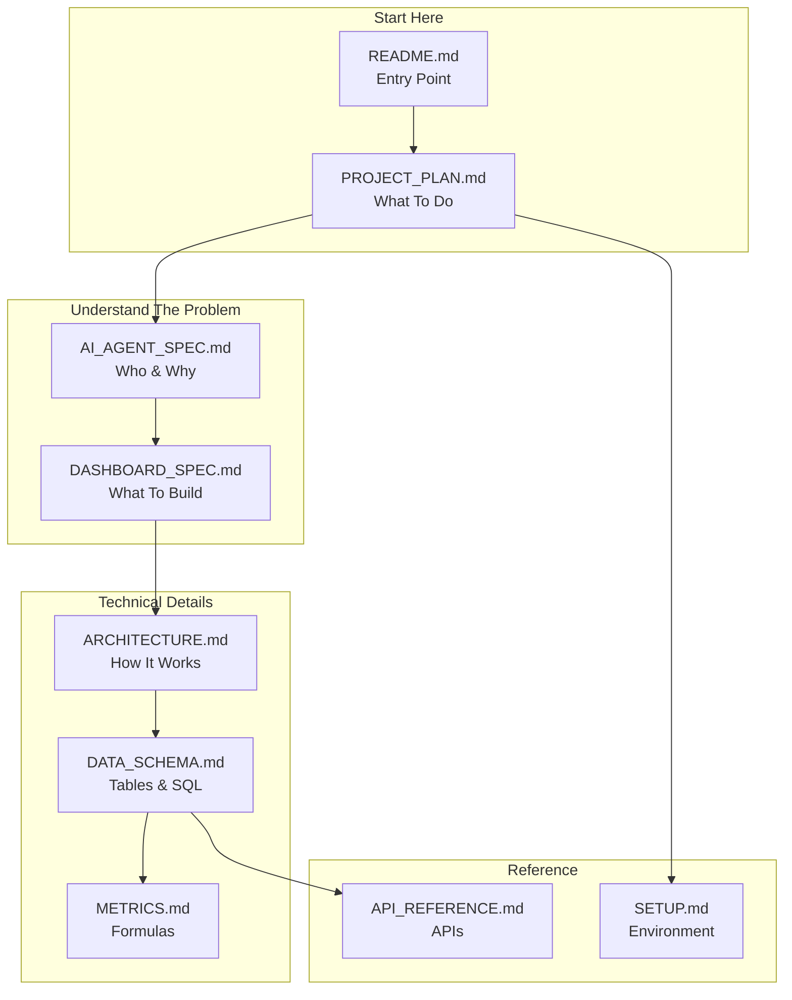

# Mobile Analytics AI Platform

Data & AI Engineering Capstone - Foundry AI Academy

## Overview

Executive Decision Support Agent for Ameno Technologies. AI chatbot that queries real mobile app revenue data (AdMob + Adjust) to answer business questions for executives without SQL knowledge.

**Primary User:** Chi Linh (Business Performance Controller)
**Deadline:** January 24, 2026

## Architecture

**Three Independent Systems → One Agent**

```
┌─────────────────────────────────────────────────────────────────┐
│                         AI AGENT                                │
│              LangGraph + Memory + Business Context              │
│                                                                 │
│  ┌─────────────┐   ┌─────────────┐   ┌─────────────┐          │
│  │ Snowflake   │   │   Kafka     │   │    RAG      │          │
│  │   Tool      │   │   Tool      │   │   Tool      │          │
│  └─────────────┘   └─────────────┘   └─────────────┘          │
└─────────────────────────────────────────────────────────────────┘
        │                    │                    │
        ▼                    ▼                    ▼
┌───────────────┐   ┌───────────────┐   ┌───────────────┐
│   SYSTEM 1    │   │   SYSTEM 2    │   │   SYSTEM 3    │
│  Batch Data   │   │  Streaming    │   │  Documents    │
├───────────────┤   ├───────────────┤   ├───────────────┤
│ Real AdMob/   │   │ Simulated     │   │ PDF docs      │
│ Adjust data   │   │ metrics       │   │ Vector store  │
│ Snowflake     │   │ Local Kafka   │   │               │
│ dbt transform │   │               │   │               │
│ CORE VALUE    │   │ CHECKBOX      │   │ CHECKBOX      │
└───────────────┘   └───────────────┘   └───────────────┘
```

## Project Status

| Phase | Description | Status | Points |
|-------|-------------|--------|--------|
| Phase 0 | API Client + CSV | Done | - |
| Phase 1-2 | Snowflake + dbt | Done | 30 |
| Phase 2.5 | Full Portfolio + LTV Curve (D0-D7) | **In Progress** | - |
| Phase 3 | Kafka + Airflow | To Do | 15 |
| Phase 4 | AI Agent | Priority | 20 |
| Phase 5 | Docs + Demo | To Do | 10 |

**Midterm:** 75/100 | **Target:** 80+ points

## Quick Start

```bash
# Activate environment
cd /Users/lehongthai/code_personal/fa-c002-lab
source .venv/bin/activate

# Data collection
python scripts/collect_adjust_capstone.py --days 3
python scripts/collect_admob_capstone.py --days 3

# dbt pipeline
cd my_dbt_project && dbt build
```

## Key Metrics

| Metric | Formula | Business Use |
|--------|---------|--------------|
| **D0 ROAS** | ad_revenue_d0 / network_cost | Immediate profitability (70-80% of LTV) |
| **D7 ROAS** | ad_revenue_d7 / network_cost | Near-complete LTV (~95%) |
| **CPI** | network_cost / installs | Cost per install |
| **eCPM** | (ad_revenue / impressions) × 1000 | Ad efficiency |
| **IMPDAU** | ad_impressions_d0 / daus | Ads per user |

**LTV Curve:** D0 = 70-80%, D1 = +8%, D3 = +5%, D7 = +3% → D7 cumulative ~95% of lifetime value.

## Documentation



| Doc | Purpose |
|-----|---------|
| [PROJECT_PLAN.md](docs/PROJECT_PLAN.md) | Phases, status, execution checklists |
| [AI_AGENT_SPEC.md](docs/AI_AGENT_SPEC.md) | User context (chi Linh), requirements |
| [DASHBOARD_SPEC.md](docs/DASHBOARD_SPEC.md) | 10 tabs mapping, MVP flow, agent phases |
| [ARCHITECTURE.md](docs/ARCHITECTURE.md) | Technical architecture, 3 systems |
| [DATA_SCHEMA.md](docs/DATA_SCHEMA.md) | Snowflake tables, SQL examples |
| [METRICS.md](docs/METRICS.md) | All metric formulas (single source) |
| [SETUP.md](docs/SETUP.md) | Environment setup |
| [API_REFERENCE.md](docs/API_REFERENCE.md) | AdMob/Adjust API details |

## Project Structure

```
fa-c002-lab/
├── agent/                    # AI Agent [To Do]
│   ├── tools/                # Snowflake, Kafka, RAG tools
│   └── app.py                # Streamlit UI
├── kafka/                    # Streaming [To Do]
│   └── docker-compose.yml
├── dags/                     # Airflow [To Do]
│   └── dbt_pipeline.py
├── my_dbt_project/           # dbt models
│   └── models/
│       ├── 01_staging/
│       ├── 02_intermediate/
│       └── 03_mart/
├── scripts/                  # Data collection
│   ├── collect_adjust_capstone.py
│   └── collect_admob_capstone.py
└── docs/                     # Documentation
```

## Tech Stack

- **dbt** - SQL transformations
- **Snowflake** - Data warehouse (`DB_T34`)
- **Python** - API collection, AI agent
- **LangGraph** - AI agent framework
- **Kafka** - Streaming (checkbox)
- **Airflow** - Orchestration
- **Streamlit** - UI

---

**Last Updated:** January 2026
