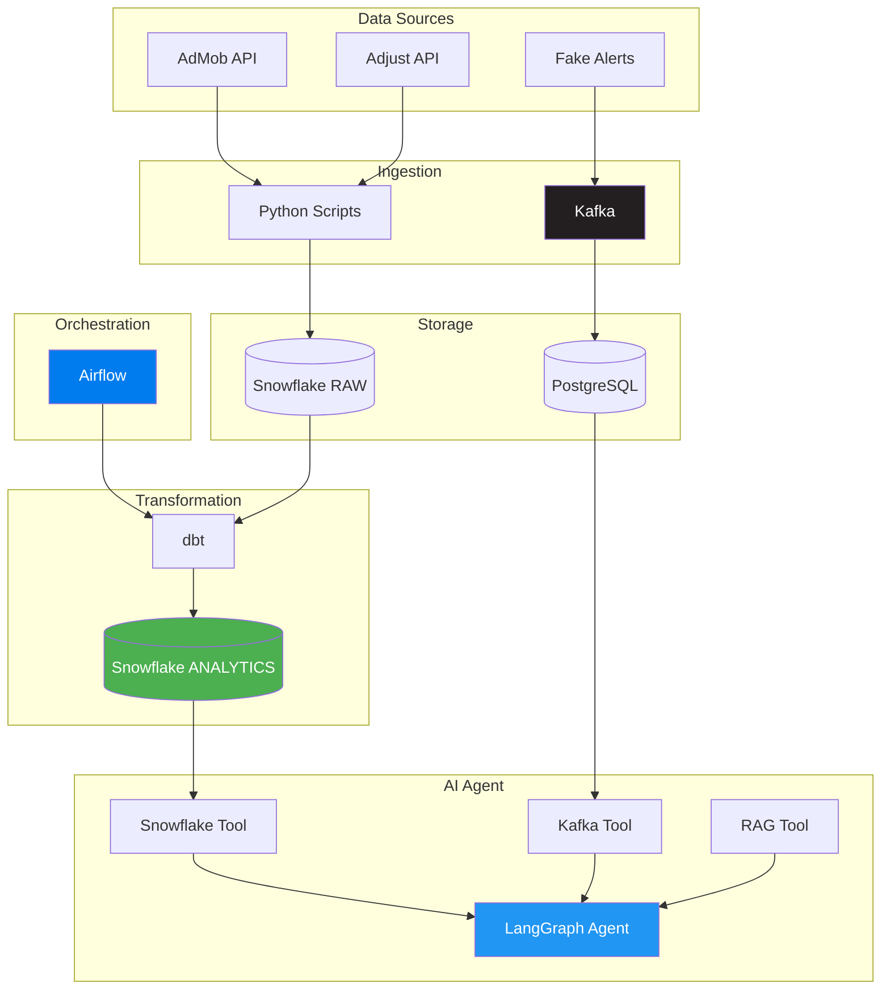

# Mobile Analytics AI Platform

Data & AI Engineering Capstone - Foundry AI Academy (FA-C002)

## Overview

Executive Decision Support Agent for Ameno Technologies. AI chatbot that queries real mobile app revenue data (AdMob + Adjust) to answer business questions for executives without SQL knowledge.

**Primary User:** Chi Linh (Business Performance Controller)
**Demo:** January 24, 2026

## Architecture



**Three Systems → One Agent:**

| System | Data | Storage | Status |
|--------|------|---------|--------|
| **Batch** | Real AdMob/Adjust | Snowflake | DONE |
| **Streaming** | Fake alerts | PostgreSQL | DONE |
| **RAG** | Business rules docs | FAISS | DONE |

## Project Status

| Phase | Description | Status | Points |
|-------|-------------|--------|--------|
| Phase 0-2 | API + Snowflake + dbt | DONE | 30 |
| Phase 2.5 | Data Backfill (29 days, 140K rows) | DONE | - |
| Phase 3 | Kafka Streaming | DONE | 7.5 |
| Phase 3 | Airflow Orchestration | DONE | 7.5 |
| Phase 4 | AI Agent Core (Snowflake + Kafka) | DONE | 15 |
| Phase 4 | RAG Tool | DONE | 10 |
| Extra | dbt Macros, Data Quality | **TO DO** | 20-40 |

**Current:** ~80 pts | **Target:** 85+ pts | **Midterm:** 75/100

## Quick Start

```bash
# 1. Start services
cd kafka && docker-compose up -d
cd ../airflow && docker-compose up -d

# 2. Generate fresh streaming alerts
cd .. && uv run python kafka/producer.py --batch 20 --interval 0

# 3. Run AI Agent
uv run python -m agent.agent --interactive

# 4. Or use Streamlit UI
uv run streamlit run agent/app.py
```

## Running Services

| Service | URL/Port | Credentials |
|---------|----------|-------------|
| Airflow UI | http://localhost:8080 | admin / admin |
| Kafka | localhost:29092 | - |
| Streaming PostgreSQL | localhost:5433 | capstone / capstone123 |

## Data Stats

| Metric | Value |
|--------|-------|
| Date Range | Dec 25, 2025 → Jan 22, 2026 (29 days) |
| Apps | 59 |
| Fact Rows | 140,546 |
| Streaming Alerts | 50+ |

## Key Business Metrics

| Metric | Formula | Business Use |
|--------|---------|--------------|
| **D0 ROAS** | ad_revenue_d0 / network_cost × 100 | Immediate profitability |
| **D7 ROAS** | ad_revenue_d7 / network_cost × 100 | Near-complete LTV |
| **CPI** | network_cost / installs | Cost per install |
| **eCPM** | (ad_revenue / impressions) × 1000 | Ad monetization efficiency |

## Project Structure

```
fa-c002-lab/
├── agent/                    # AI Agent
│   ├── config.py             # OpenAI configuration
│   ├── prompts.py            # System prompt with business context
│   ├── agent.py              # LangGraph state machine
│   ├── app.py                # Streamlit UI
│   ├── vector_store/           # FAISS index (auto-generated)
│   └── tools/
│       ├── snowflake_tools.py  # Batch data queries [DONE]
│       ├── kafka_tools.py      # Real-time alerts [DONE]
│       └── rag_tools.py        # Document search [DONE]
├── kafka/                    # Streaming Pipeline [DONE]
│   ├── docker-compose.yml    # Kafka + PostgreSQL
│   ├── producer.py           # Alert generator
│   ├── consumer.py           # PostgreSQL sink
│   └── test_setup.py         # Connection tests
├── airflow/                  # Orchestration [DONE]
│   ├── docker-compose.yml    # Airflow + PostgreSQL
│   ├── Dockerfile            # Custom image with dbt
│   ├── profiles.yml          # dbt profile for Docker
│   └── dags/
│       └── dbt_pipeline.py   # 3 tasks: debug → run → test
├── my_dbt_project/           # Data Transformation [DONE]
│   ├── models/
│   │   ├── 01_staging/       # stg_admob, stg_adjust
│   │   ├── 02_intermediate/  # int_app_daily_metrics
│   │   └── 03_mart/          # dim_apps, dim_dates, fct_performance
│   └── macros/               # calculate_ctr, etc.
├── scripts/                  # Data Collection [DONE]
│   ├── collect_adjust_capstone.py
│   └── collect_admob_capstone.py
├── .github/workflows/        # CI/CD [DONE]
│   └── dbt_ci.yml            # SQLFluff + dbt test
└── docs/                     # Documentation
    ├── business_rules/       # RAG documents [DONE]
    │   └── ameno_business_rules.md
    ├── PROJECT_PLAN.md       # Phases and status
    ├── DEMO_FLOW.md          # Demo day script
    ├── ARCHITECTURE.md       # Technical details
    └── ...
```

## CI/CD Pipeline

GitHub Actions with **2 automated checks**:
1. **SQLFluff linting** - SQL code quality
2. **dbt test** - Data quality tests

Triggers on: push/PR to `main`/`develop` for `.sql` files

See `.github/workflows/dbt_ci.yml`

## Demo Checklist

See [docs/DEMO_FLOW.md](docs/DEMO_FLOW.md) for complete demo script.

**30-minute Demo Timeline:**
1. **Real-time Pipeline** (5 min) - CI/CD + Kafka flow
2. **Batch Pipeline** (5 min) - Airflow + dbt
3. **AI Agent & RAG** (10 min) - Queries + document search
4. **Extra Features + Q&A** (10 min)

## Documentation

| Doc | Purpose |
|-----|---------|
| [CURRENT_STEP.md](CURRENT_STEP.md) | What to do NOW |
| [DEMO_FLOW.md](docs/DEMO_FLOW.md) | Demo day script |
| [PROJECT_PLAN.md](docs/PROJECT_PLAN.md) | Phases and status |
| [ARCHITECTURE.md](docs/ARCHITECTURE.md) | Technical architecture |
| [AI_AGENT_SPEC.md](docs/AI_AGENT_SPEC.md) | User context (Chi Linh) |

## Tech Stack

| Category | Technology |
|----------|------------|
| **Language** | Python 3.12 + uv |
| **Data Warehouse** | Snowflake (DB_T34) |
| **Transformation** | dbt 1.7 |
| **Streaming** | Kafka (KRaft mode) |
| **Orchestration** | Airflow 2.8 (LocalExecutor) |
| **AI Agent** | LangGraph + OpenAI GPT-4o-mini |
| **Vector Store** | FAISS + OpenAI Embeddings |
| **UI** | Streamlit |
| **CI/CD** | GitHub Actions |

---

**Last Updated:** January 24, 2026
