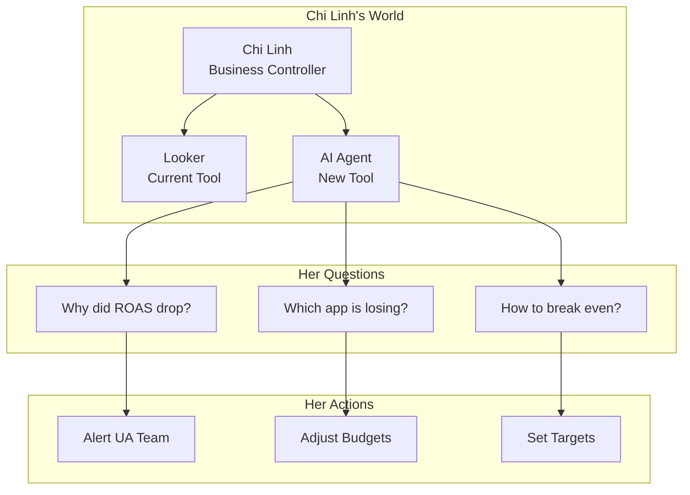

# AI Agent Specification

Who uses the system, what they need, and why.



**Related docs:**
- `DASHBOARD_SPEC.md` - What to build (tabs, MVP flow, agent phases)
- `METRICS.md` - How to calculate metrics

---

## Part 1: Understanding The User

### Who is Chi Linh?

**Role:** Business Performance Controller

Chi Linh ensures the company is profitable. She bridges data and business decisions.

**Important:** She does NOT execute. UA team decides spend amounts and campaigns. She sets direction, tracks progress, and alerts when issues arise.

### Why This Role Matters

Mobile app business characteristics:

1. **High burn rate:** Company spends ~$10K/day on user acquisition. Without tight tracking, could lose $300K/month unknowingly.

2. **Slow feedback loop:** Spend today, revenue accumulates over time. Must understand D0, D1, D7... to know profitability.

3. **Many variables:** 10 apps × 50+ countries × multiple ad networks = hundreds of combinations. Cannot track manually.

Chi Linh is the "gatekeeper" - ensuring money flows to profitable channels.

---

## Part 2: How Chi Linh Thinks

### Mental Model: The Profitability Equation

Everything she does centers on one equation:

```
Profit = Revenue - Cost

Expanded:
Profit = (IAA Revenue + IAP Revenue) - Network Cost

Further expanded (how she thinks):
Profit = (Users × Ads_per_user × Money_per_ad) + (Users × %_paying × ARPU) - (Users × Cost_per_user)
```

From this equation, she derives metrics:

| Component | Metric | Meaning |
|-----------|--------|---------|
| Users | Installs, DAU | How many users? |
| Cost_per_user | CPI | Cost to buy 1 user? |
| Ads_per_user | IMPDAU | Ads watched per user? |
| Money_per_ad | eCPM | Revenue per 1000 ads? |
| %_paying | Conversion | % users who pay for IAP? |
| ARPU | Revenue per payer | How much do payers spend? |

**Key insight:** She doesn't view metrics in isolation. She sees them as "levers" to pull for increasing profit.

### The Time Dimension: Why D0 Matters

Mobile app user behavior:

```
Day 0 (Install day): User most engaged, uses most
Day 1: ~40% return
Day 7: ~15% return
Day 30: ~5% return
```

**Implication:** 70-80% of total revenue comes from Day 0.

**Therefore:** If D0 ROAS < 100%, campaign will likely lose money. D1+ retention only recovers ~20-30% more.

**Her mental thresholds:**
- D0 ROAS > 100%: Good, can scale
- D0 ROAS 80-100%: Check D7 retention
- D0 ROAS < 80%: Losing money, need action

### The Hierarchy: How She Drills Down

When issues arise, she follows a fixed pattern:

```
Level 0: Total (all apps, all countries)
         "What's total ROAS this month? On track?"
              ↓ If off track
Level 1: By App
         "Which app is dragging ROAS down?"
              ↓ Found problem app
Level 2: By Country
         "In that app, which country has issues?"
              ↓ Found country
Level 3: By Ad Source
         "Is Facebook or Google traffic problematic?"
              ↓ Found source
Level 4: By Ad Unit / Creative
         "Which ad isn't performing?"
              ↓
ROOT CAUSE → ACTION
```

**Key insight:** She doesn't explore randomly. She follows a funnel from macro → micro until finding root cause.

**Agent implication:** Agent must support drill-down flow, not just answer isolated questions.

---

## Part 3: The Decision Framework

### When Does She Alert the Team?

Mental thresholds:

| Situation | Threshold | Action |
|-----------|-----------|--------|
| ROAS drop | < 80% or > 20% drop vs last week | Alert UA to pause/optimize |
| CPI spike | > 30% increase vs average | Check auction, creative fatigue |
| eCPM drop | > 15% decrease | Check ad network issues, seasonality |
| Data mismatch | Adjust vs AdMob diff > 5% | Check data pipeline |

### Her Questions and Logic

**Question 1:** "Which app spends most? Profitable or not?"

```
Logic:
- High spend + profitable = Scale more
- High spend + losing = Dangerous, immediate action
- Low spend + profitable = Opportunity to scale
- Low spend + losing = Accept or kill
```

**Question 2:** "Why did metrics change vs yesterday?"

```
Logic:
ROAS dropped could be due to:
├── Revenue dropped
│   ├── eCPM dropped (ad network paying less)
│   ├── IMPDAU dropped (users watching fewer ads)
│   └── DAU dropped (fewer users)
└── Cost increased
    ├── CPI increased (auction more expensive)
    └── Install volume increased (spending more)

She needs to know WHICH factor changed to know WHAT action to take.
```

**Question 3:** "How to break even?"

```
Logic:
ROAS = Revenue / Cost = (eCPM × IMPDAU) / (CPI × 1000)

For ROAS = 100%:
- Option A: Lower CPI (negotiate rates, better targeting)
- Option B: Raise eCPM (better placements, premium networks)
- Option C: Raise IMPDAU (more ad units, better UX)

She needs simulation: "If CPI drops 10%, what's new ROAS?"
```

**Question 4:** "Can this losing app become profitable?"

```
Logic:
Factors that can change:
├── External (hard to control)
│   ├── eCPM may rise with seasonality (Q4 usually high)
│   ├── CPI may drop if auction less competitive
│   └── Market conditions
└── Internal (can control)
    ├── Product improvements → raise IMPDAU
    ├── Better ad mediation → raise eCPM
    └── Better targeting → lower CPI

She needs data to justify: "If dev team improves retention 10%, profitable?"
```

---

## Part 4: Data Quality Awareness

### Why Two Data Sources?

```
AdMob (Google):
- Source of truth for REVENUE (real money in bank)
- Limitation: No attribution (doesn't know where user came from)

Adjust (Attribution):
- Source of truth for ATTRIBUTION (user from Facebook or Google)
- Can estimate revenue but not 100% accurate
- Has D0 metrics (knows revenue by install day)
```

### Reconciliation Logic

```
% diff rev = |adjust_revenue - admob_revenue| / admob_revenue

Healthy: < 5% difference
Warning: 5-10% difference
Critical: > 10% difference (data pipeline issue)

If large mismatch:
1. Check if API collection failed
2. Check timezone differences
3. Check currency conversion
4. Check app store ID mapping
```

---

## Part 5: Agent Positioning

### Complement Looker, Don't Replace

| Looker (visual) | AI Agent (conversational) |
|-----------------|---------------------------|
| View trends, patterns | Ask specific questions |
| Filter and explore | Natural language query |
| Static dashboards | Dynamic drill-down |
| She interprets | Agent explains WHY |

### What Agent Should Do

1. **Automate routine analysis** - What chi Linh does every morning in Looker
2. **Answer "why" questions** - Root cause analysis with drill-down
3. **Simulate scenarios** - "If CPI drops 15%, what happens to ROAS?"
4. **Alert proactively** - Detect anomalies before she checks

See `DASHBOARD_SPEC.md` for detailed agent capabilities and phases.

---

## Part 6: Current Limitations

### Data Limitations

- **No Ad Source breakdown:** Data is total only, not split by Facebook/Google/TikTok
- **No Ad Unit breakdown:** Cannot differentiate banner vs interstitial vs rewarded
- **IAP tracking incomplete:** SDK not fully capturing

### Data Capabilities (Supported)

- **LTV cohort analysis:** D0, D1, D3, D7 cohort metrics for revenue and impressions
- **Full portfolio:** 45+ apps, 240 countries, all platforms
- **LTV curve:** Can track ~95% of user lifetime value (D0 = 70-80%, D7 cumulative = ~95%)

### Functional Limitations

- **Read-only:** Agent queries and explains, does not execute actions
- **Daily batch:** Data updates once/day, not real-time
- **No forecasting:** Analyzes historical only, no predictions

### Future Considerations

- Integrate Ad Source data from Facebook/Google APIs
- Add D30 retention for long-term cohort tracking
- Real-time alerting via Slack/Email
- Action suggestions with confidence scores

---

## Part 7: Success Metrics

### Phase 1 Success (Query)

| Metric | Target | Measurement |
|--------|--------|-------------|
| Query accuracy | 100% match Looker | Spot check 20 queries |
| Response time | < 10 seconds | Monitor p95 latency |
| Adoption | Chi Linh uses daily | Usage logs |

### Phase 2+ Success (Explain, Simulate, Alert)

| Metric | Target | Measurement |
|--------|--------|-------------|
| Time saved | 30 min → 5 min drill-down | User feedback |
| Alert accuracy | < 3 false positives/week | Track alert outcomes |
| Trust level | Actions without Looker verify | User feedback |

---

## Appendix: Chi Linh's Actual Questions

From meeting notes, questions she will ask:

1. "Which app spends most, and is it profitable with current cost?"
2. "If we increase spend, how does it affect other metrics?"
3. "Why did metrics increase/decrease vs yesterday?"
4. "How to break even?"
5. "This app has been losing money, can it become profitable?"
6. "What factor caused the changes I'm observing?"
7. "What's installs over time by country?"
8. "Compare CPI vs 100% CPI to see if there's room"
9. "Revenue breakdown by country?"
10. "Does data match? What's Adjust vs AdMob diff %?"

---

## Revision History

| Date | Change |
|------|--------|
| Jan 2026 | Updated limitations: D0-D7 cohort analysis now supported |
| Jan 2026 | Initial creation based on user interviews |
| Jan 2026 | Restructured: moved metrics to METRICS.md, dashboard details to DASHBOARD_SPEC.md |
