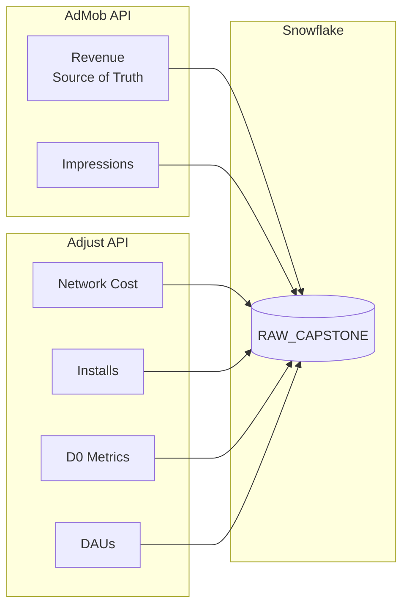

# API Reference



## AdMob API v1

### Current Configuration

```python
"dimensions": ["APP", "DATE", "COUNTRY", "PLATFORM"]
"metrics": ["ESTIMATED_EARNINGS", "IMPRESSIONS"]
```

### Available Dimensions

| Dimension | Description | Example |
|-----------|-------------|---------|
| APP | App identifier | `ca-app-pub-xxx~xxx` |
| AD_UNIT | Specific ad placement | `banner_main` |
| DATE | Daily breakdown | `2025-09-19` |
| MONTH | Monthly grouping | `2025-09` |
| WEEK | Weekly grouping | `2025-W38` |
| HOUR | Hourly data (last 28 days) | `2025-09-19T14` |
| COUNTRY | Geographic | `US`, `IN`, `BR` |
| PLATFORM | Operating system | `iOS`, `Android` |
| AD_TYPE | Ad format | `BANNER`, `INTERSTITIAL`, `REWARDED` |
| AD_SOURCE | Ad network | `AdMob Network`, `Facebook` |

### Available Metrics

| Metric | In Use | Description |
|--------|--------|-------------|
| ESTIMATED_EARNINGS | Yes | Revenue in USD |
| IMPRESSIONS | Yes | Ads shown count |
| CLICKS | No | Ads clicked count |
| MATCHED_REQUESTS | No | Successful ad requests |
| AD_REQUESTS | No | Total ad requests |
| OBSERVED_ECPM | No | Effective CPM |
| MATCH_RATE | No | % requests matched |
| SHOW_RATE | No | % matched ads shown |

### API Limits

- **1,000 requests/day** (can request increase)
- **180 days max** per request
- **100K rows max** per report
- **~3 hour data delay** for earnings
- **Hourly data**: Last 28 days only

### Validation Results

- Daily granularity: Confirmed working
- Hourly granularity: **NOT available** (tested 6 configurations, all failed)
- Volume: 13,508 rows/day with full dimensions
- Historical depth: 365+ days confirmed

---

## Adjust API

### Current Configuration

```python
dimensions = "app,store_id,day,country_code,country,os_name"
metrics = ",".join([
    # User acquisition
    "installs", "clicks", "daus",
    # Revenue (non-cohort)
    "ad_revenue", "ad_impressions",
    # Cost
    "network_cost", "paid_impressions",
    # D0-D7 Cohort metrics (LTV curve)
    "ad_revenue_total_D0", "ad_impressions_total_D0",
    "ad_revenue_total_D1", "ad_impressions_total_D1",
    "ad_revenue_total_D3", "ad_impressions_total_D3",
    "ad_revenue_total_D7", "ad_impressions_total_D7",
    # IAP
    "subscrevnt_revenue",
])
```

### Available Dimensions (146 total)

| Category | Dimensions |
|----------|------------|
| Time | day, week, month, hour |
| Geographic | country, region, city, country_code |
| Technical | os_name, device_type, sdk_version |
| Marketing | network, campaign, adgroup, creative |
| User | cohort_maturity, user_type |
| App | app, store_id, app_version |

### Available Metrics (82 total)

| Category | Metrics |
|----------|---------|
| User Acquisition | installs, clicks, impressions, ctr |
| Engagement | daus, waus, maus, sessions |
| Revenue | ad_revenue, iap_revenue, ltv, arpu |
| Marketing | network_cost, ecpi, roas, roi |
| Retention | retention_d1, retention_d7, retention_d30 |
| Cohort | cohort_size, cohort_revenue, cohort_ltv |

### Cohort Metrics (D0-D7 for LTV Curve)

| Metric | Description | LTV Contribution |
|--------|-------------|------------------|
| ad_revenue_total_D0 | Day 0 ad revenue (install day) | 70-80% |
| ad_impressions_total_D0 | Day 0 ad impressions | |
| ad_revenue_total_D1 | Cumulative through day 1 | +8% |
| ad_impressions_total_D1 | Cumulative impressions through D1 | |
| ad_revenue_total_D3 | Cumulative through day 3 | +5% |
| ad_impressions_total_D3 | Cumulative impressions through D3 | |
| ad_revenue_total_D7 | Cumulative through day 7 | +3% (~95% total) |
| ad_impressions_total_D7 | Cumulative impressions through D7 | |

**Note:** Adjust supports D0-D120 cohorts. We use D0, D1, D3, D7 for practical LTV analysis.

### API Limits

- **10-100 requests/hour** (plan dependent)
- **90 days to unlimited** retention (plan dependent)
- **1-6 hour data delay** depending on metric

### Validation Results

- **Hourly granularity: AVAILABLE** (936 rows/day)
- Daily granularity: 2,216 rows/day
- Historical depth: 365+ days confirmed
- IAP revenue: **NOT available** (not configured in SDK)

---

## Data Consistency

### Why AdMob vs Adjust Revenue Differs

1. **Time zones**: Different UTC offset settings
2. **Attribution windows**: Different attribution logic
3. **Network delays**: Impressions counted at different times
4. **Revenue recognition**: AdMob = actual, Adjust = estimated

**Expected variance:** 2-5% is normal

### Matching Fields

```python
AdMob.APP_STORE_ID == Adjust.store_id
AdMob.DATE == Adjust.day
AdMob.COUNTRY == Adjust.country_code  # (case-insensitive)
AdMob.PLATFORM == Adjust.os_name      # (lowercase in Adjust)
```

### Revenue Source of Truth

- **AdMob**: Source of truth for financial reporting (actual revenue)
- **Adjust**: Source for user acquisition metrics and cost data

---

## Enhancement Opportunities

### Add More AdMob Metrics

```python
"metrics": [
    "ESTIMATED_EARNINGS", "IMPRESSIONS",
    "CLICKS", "AD_REQUESTS", "OBSERVED_ECPM"
]
```

**Benefit:** Calculate click-through rates, fill rates

### Add Ad Unit Breakdown

```python
"dimensions": ["APP", "DATE", "COUNTRY", "PLATFORM", "AD_UNIT", "AD_TYPE"]
```

**Benefit:** Optimize specific ad placements

### Add Hourly Data (Adjust only)

```python
dimensions = "app,store_id,day,hour,country_code,os_name"
```

**Benefit:** Real-time campaign monitoring (last 28 days)

### Add Retention Metrics

```python
metrics = "installs,daus,ad_revenue,retention_d1,retention_d7,ltv,sessions"
```

**Benefit:** Understand user lifecycle and long-term value

---

## Data Volume Summary

### Daily Volume (Full Portfolio)

| Source | Apps | Countries | Rows/Day |
|--------|------|-----------|----------|
| AdMob (3 publishers) | 55 | 225 | ~3,800 |
| Adjust (1 API key) | 45 | 240 | ~4,200 |

### Monthly Projection

| Source | Rows |
|--------|------|
| AdMob | ~114K |
| Adjust | ~126K |

### Yearly Projection

| Source | Rows/Year |
|--------|-----------|
| AdMob | ~1.4M |
| Adjust | ~1.5M |
| **Total** | ~2.9M |

---

## Test Scripts

Scripts used for API validation:

```bash
python test_api_capabilities.py      # AdMob dimension/metric testing
python test_hour_dimension.py        # AdMob HOUR dimension deep dive
python test_adjust_capabilities.py   # Adjust endpoint validation
```

---

## Collection Scripts

```bash
# Collect from Adjust API → RAW_CAPSTONE.ADJUST_DAILY
python scripts/collect_adjust_capstone.py --days 3

# Collect from AdMob API → RAW_CAPSTONE.ADMOB_DAILY
python scripts/collect_admob_capstone.py --days 3
```

**Schema:** `DB_T34.RAW_CAPSTONE`
