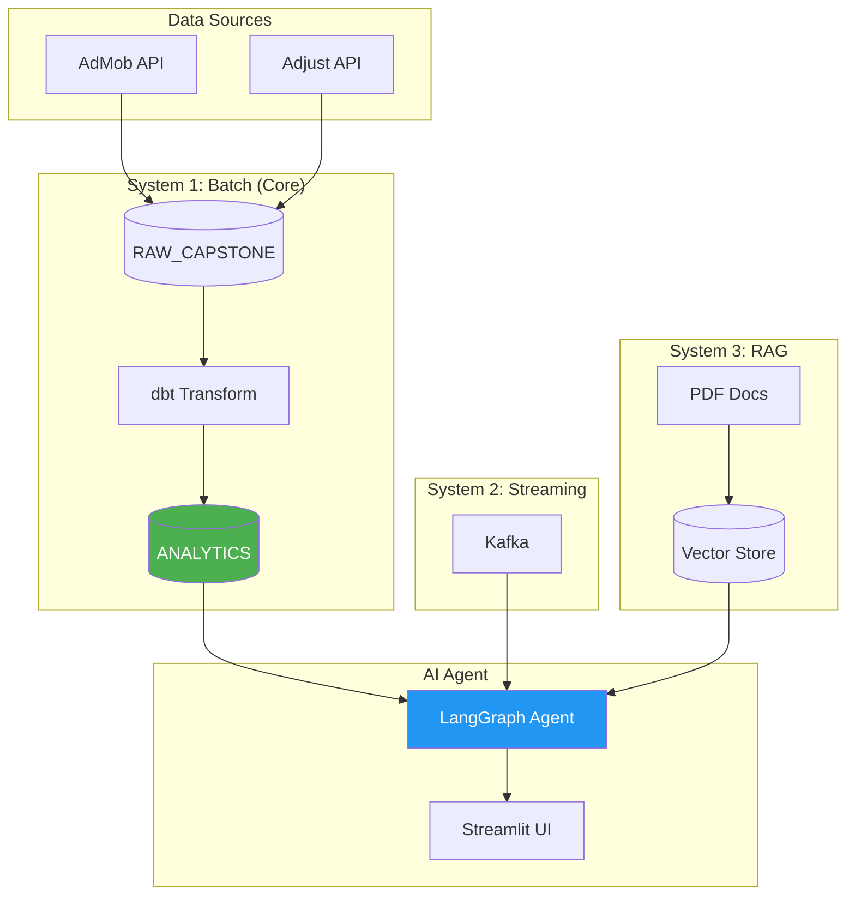

# Architecture

How the system works technically.



**Related docs:**
- `DATA_SCHEMA.md` - Table schemas and SQL examples
- `METRICS.md` - Metric calculation formulas

---

## System Overview

**Three Independent Systems → One Agent**

```
┌─────────────────────────────────────────────────────────────────┐
│                         AI AGENT                                │
│              LangGraph + Memory + Business Context              │
│                                                                 │
│  ┌─────────────┐   ┌─────────────┐   ┌─────────────┐          │
│  │ Snowflake   │   │   Kafka     │   │    RAG      │          │
│  │   Tool      │   │   Tool      │   │   Tool      │          │
│  └─────────────┘   └─────────────┘   └─────────────┘          │
└─────────────────────────────────────────────────────────────────┘
        │                    │                    │
        ▼                    ▼                    ▼
┌───────────────┐   ┌───────────────┐   ┌───────────────┐
│   SYSTEM 1    │   │   SYSTEM 2    │   │   SYSTEM 3    │
│  Batch Data   │   │  Streaming    │   │  Documents    │
├───────────────┤   ├───────────────┤   ├───────────────┤
│ Real AdMob/   │   │ Simulated     │   │ PDF docs      │
│ Adjust data   │   │ metrics       │   │ Vector store  │
│ Snowflake     │   │ Local Kafka   │   │ Chroma/FAISS  │
│ dbt transform │   │ Docker        │   │               │
│               │   │               │   │               │
│ CORE VALUE    │   │ CHECKBOX      │   │ CHECKBOX      │
└───────────────┘   └───────────────┘   └───────────────┘
```

**Key Point:** Systems 2 and 3 are independent checkboxes. They don't integrate with System 1. Agent queries each separately.

---

## System 1: Batch Data Pipeline (Core)

### Data Flow

```
PYTHON COLLECTION           SNOWFLAKE RAW              DBT TRANSFORMATION         ANALYTICS
┌─────────────────┐        ┌─────────────────┐        ┌─────────────────┐        ┌─────────────────┐
│ collect_admob   │───────▶│ ADMOB_DAILY     │───────▶│ stg_admob       │───┐    │ dim_apps        │
│ collect_adjust  │───────▶│ ADJUST_DAILY    │───────▶│ stg_adjust      │───┼───▶│ dim_dates       │
└─────────────────┘        └─────────────────┘        └─────────────────┘   │    │ fct_performance │
                                                              │             │    └─────────────────┘
                                                              ▼             │
                                                      ┌─────────────────┐   │
                                                      │ int_app_daily   │───┘
                                                      │ _metrics        │
                                                      └─────────────────┘
```

**Schema:** `DB_T34.RAW_CAPSTONE` (raw) → `DB_T34.ANALYTICS` (mart)

### Star Schema

```
                    ┌─────────────────────────────────────────┐
                    │         fct_app_daily_performance       │
                    ├─────────────────────────────────────────┤
                    │ performance_key (PK)                    │
┌──────────────┐    │ app_key (FK) ─────────────────────────┐ │    ┌──────────────┐
│   dim_apps   │    │ date_key (FK) ───────────────────────┐│ │    │  dim_dates   │
├──────────────┤    │ country_code                         ││ │    ├──────────────┤
│ app_key (PK) │◀───│ platform                             ││ │───▶│ date_key (PK)│
│ app_store_id │    │                                      ││ │    │ date         │
│ app_name     │    │ -- AdMob (source of truth) --        ││ │    │ year, month  │
└──────────────┘    │ ad_revenue, ad_impressions, ad_clicks││ │    │ day_of_week  │
                    │                                      ││ │    └──────────────┘
                    │ -- User Metrics --                   ││ │
                    │ installs, clicks, daus               ││ │
                    │                                      ││ │
                    │ -- D0-D7 Cohort (LTV curve) --       ││ │
                    │ ad_revenue_d0, ad_impressions_d0     ││ │
                    │ ad_revenue_d1, ad_impressions_d1     ││ │
                    │ ad_revenue_d3, ad_impressions_d3     ││ │
                    │ ad_revenue_d7, ad_impressions_d7     │└─┘
                    │                                      │
                    │ -- Cost & IAP --                     │
                    │ network_cost, paid_impressions       │
                    │ subscrevnt_revenue                   │
                    └─────────────────────────────────────────┘
```

**Grain:** One row per app × date × country × platform

### dbt Layers

| Layer | Model | Type | Purpose |
|-------|-------|------|---------|
| Staging | stg_admob_capstone | View | Clean AdMob data |
| Staging | stg_adjust_capstone | View | Clean Adjust data |
| Intermediate | int_app_daily_metrics | Incremental | Join sources |
| Mart | dim_apps | Table | App dimension |
| Mart | dim_dates | Table | Date dimension |
| Mart | fct_app_daily_performance | Table | Fact table |

### Metrics Strategy

**Stored in fact table (raw values):**
- ad_revenue, ad_impressions, ad_clicks (AdMob - source of truth)
- ad_revenue_adjust, ad_impressions_adjust (for reconciliation)
- installs, clicks, daus
- ad_revenue_d0/d1/d3/d7, ad_impressions_d0/d1/d3/d7 (LTV cohorts)
- network_cost, paid_impressions, subscrevnt_revenue

**Calculated at query time:**
- d0_roas, d7_roas, cpi, ecpm, impdau (see METRICS.md)

**Rationale:** Store raw values, calculate aggregates at query time for flexibility.

---

## System 2: Streaming (Checkbox)

### Architecture

```
┌─────────────────┐     ┌─────────────────┐     ┌─────────────────┐
│ Fake Producer   │────▶│  Kafka Topic    │────▶│    Consumer     │
│ (Python)        │     │  (Docker)       │     │    (Python)     │
└─────────────────┘     └─────────────────┘     └─────────────────┘
                                │
                                ▼
                        ┌─────────────────┐
                        │  Agent Tool     │
                        │  (query latest) │
                        └─────────────────┘
```

### Purpose

- Demonstrate streaming capability for grading
- Independent from batch pipeline
- Uses simulated/fake data

### Components

| Component | Location | Description |
|-----------|----------|-------------|
| Docker setup | `kafka/docker-compose.yml` | Kafka + Zookeeper |
| Producer | `kafka/producer.py` | Generate fake metrics |
| Consumer | `kafka/consumer.py` | Read and store |
| Agent tool | `agent/tools/kafka_tools.py` | Query latest data |

**NOT required:** Push to Snowflake, integrate with batch flow

---

## System 3: RAG Documents (Checkbox)

### Architecture

```
┌─────────────────┐     ┌─────────────────┐     ┌─────────────────┐
│   PDF Docs      │────▶│  Chunking +     │────▶│  Vector Store   │
│   (any docs)    │     │  Embedding      │     │  (Chroma/FAISS) │
└─────────────────┘     └─────────────────┘     └─────────────────┘
                                                        │
                                                        ▼
                                                ┌─────────────────┐
                                                │  Agent Tool     │
                                                │  (RAG query)    │
                                                └─────────────────┘
```

### Purpose

- Demonstrate RAG capability for grading
- Answer questions about documents
- Independent from data pipeline

### Components

| Component | Location | Description |
|-----------|----------|-------------|
| Loader | `agent/rag/document_loader.py` | Load and chunk PDFs |
| Vector store | `agent/rag/vector_store.py` | Embed and store |
| Agent tool | `agent/tools/rag_tools.py` | Retrieval tool |

**NOT required:** Complex chunking, production RAG

---

## Agent Architecture

### LangGraph Structure

```
┌─────────────────────────────────────────────────┐
│                   AGENT                         │
│  ┌───────────────────────────────────────────┐  │
│  │              State Graph                   │  │
│  │  ┌─────────┐    ┌─────────┐    ┌────────┐ │  │
│  │  │ Receive │───▶│ Think   │───▶│ Act    │ │  │
│  │  │ Query   │    │ (LLM)   │    │ (Tool) │ │  │
│  │  └─────────┘    └─────────┘    └────────┘ │  │
│  └───────────────────────────────────────────┘  │
│                                                 │
│  ┌───────────────────────────────────────────┐  │
│  │              Tools                         │  │
│  │  ┌──────────┐ ┌──────────┐ ┌──────────┐  │  │
│  │  │Snowflake │ │ Kafka    │ │ RAG      │  │  │
│  │  │ Query    │ │ Query    │ │ Query    │  │  │
│  │  └──────────┘ └──────────┘ └──────────┘  │  │
│  └───────────────────────────────────────────┘  │
│                                                 │
│  ┌───────────────────────────────────────────┐  │
│  │              Memory                        │  │
│  │  Conversation history + Business context   │  │
│  └───────────────────────────────────────────┘  │
└─────────────────────────────────────────────────┘
```

### Tools

| Tool | System | Description |
|------|--------|-------------|
| query_metrics | Batch | Execute SQL on fact table |
| compare_periods | Batch | Compare two time ranges |
| drill_down | Batch | Breakdown by dimension |
| query_streaming | Streaming | Get latest Kafka data |
| query_documents | RAG | Search vector store |

---

## Project Structure

```
fa-c002-lab/
├── agent/                    # AI Agent
│   ├── agent.py              # LangGraph agent
│   ├── app.py                # Streamlit UI
│   ├── tools/
│   │   ├── snowflake_tools.py
│   │   ├── kafka_tools.py
│   │   └── rag_tools.py
│   └── rag/
│       ├── document_loader.py
│       └── vector_store.py
├── kafka/                    # Streaming (checkbox)
│   ├── docker-compose.yml
│   ├── producer.py
│   └── consumer.py
├── dags/                     # Airflow
│   └── dbt_pipeline.py
├── my_dbt_project/           # dbt models
│   └── models/
│       ├── 01_staging/
│       ├── 02_intermediate/
│       └── 03_mart/
├── scripts/                  # Data collection
│   ├── collect_adjust_capstone.py
│   └── collect_admob_capstone.py
└── docs/                     # Documentation
```

---

## Data Loading Patterns

### Idempotency Strategy: Delete-Insert

**Problem:** Collection scripts use APPEND mode. Running twice = duplicates.

**Solution:** Delete-before-insert for the target date range.

```
┌─────────────────────────────────────────────────────────────────┐
│                    IDEMPOTENT LOAD PATTERN                      │
├─────────────────────────────────────────────────────────────────┤
│  1. DELETE FROM table WHERE date BETWEEN start AND end          │
│  2. INSERT new data for that range                              │
│  3. Result: Same data regardless of how many times you run      │
└─────────────────────────────────────────────────────────────────┘
```

**Benefits:**
- Airflow retry → safe (no duplicates)
- Manual re-run → safe
- Backfill any date range → just specify dates

**Implementation locations:**

| Component | Pattern |
|-----------|---------|
| `collect_adjust_capstone.py` | DELETE + INSERT for date range |
| `collect_admob_capstone.py` | DELETE + INSERT for date range |
| `int_app_daily_metrics` | dbt incremental with `unique_key` |
| Airflow DAG | Passes `execution_date`, relies on script idempotency |

**Commands for common operations:**

```bash
# Reload yesterday (safe to re-run)
python scripts/collect_adjust_capstone.py --days 1

# Backfill specific range
python scripts/collect_adjust_capstone.py --start 2025-12-01 --end 2025-12-31

# Full refresh (truncate + reload)
TRUNCATE TABLE DB_T34.RAW_CAPSTONE.ADJUST_DAILY;
python scripts/collect_adjust_capstone.py --start 2025-09-24 --end 2026-01-22
```

---

## Key Design Decisions

| Decision | Choice | Reasoning |
|----------|--------|-----------|
| Star schema | Yes | Industry standard, good for analytics |
| 3 dbt layers | Yes | Clear separation, debuggable |
| Incremental | Yes | Required by grading, efficient |
| Raw metrics in fact | Yes | Flexibility for aggregations |
| 3 independent systems | Yes | Simpler implementation, meets requirements |
| Agent tools separate | Yes | Each system queried independently |
| Delete-insert pattern | Yes | Idempotent loads, safe retries |

---

## Revision History

| Date | Change |
|------|--------|
| Jan 2026 | Added D0-D7 cohort metrics to star schema |
| Jan 2026 | Consolidated architecture content, added agent architecture |
