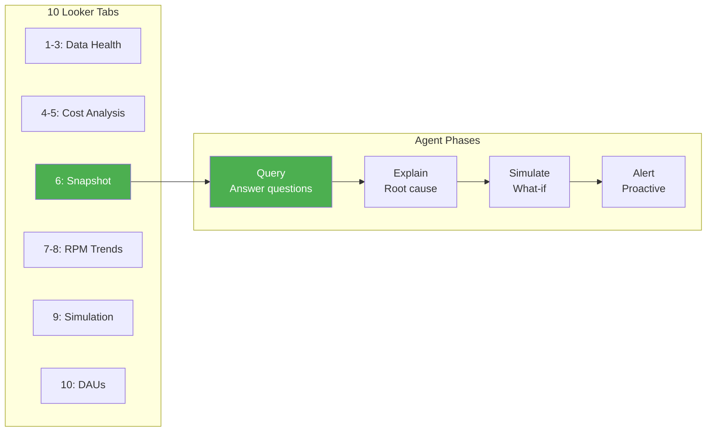

# Dashboard Specification

What to build: UI tabs, data mapping, MVP user flow, and agent capabilities.



---

## Overview

**Goal:** Replicate chi Linh's Looker workflow, then enhance with AI agent.

**Approach:**
1. Build Streamlit dashboards mirroring her 10 Looker tabs
2. Agent automates routine analysis
3. Chi Linh focuses on strategic questions

---

## Part 1: Looker Tabs Mapping

### Tab 1: Detail by App (Data Health)

**Purpose:** Reconcile Adjust vs AdMob revenue by app.

| Metric | Formula | Data Source |
|--------|---------|-------------|
| adjust_rev | SUM(ad_revenue) | ADJUST_DAILY |
| admob_rev | SUM(estimated_earnings) | ADMOB_DAILY |
| % diff rev | ABS(adjust - admob) / admob | Calculated |
| % diff imp | ABS(adjust_imp - admob_imp) / admob_imp | Calculated |
| network_cost | SUM(network_cost) | ADJUST_DAILY |

**Group by:** app_name
**Data support:** Full

### Tab 2: Detail by Country (Data Health)

**Purpose:** Same as Tab 1, breakdown by country.

**Group by:** country_code
**Data support:** Full

### Tab 3: Detail by Date (Data Health)

**Purpose:** Time-series data health check.

**Group by:** date
**Data support:** Full

### Tab 4: Cost by App

**Purpose:** UA efficiency and monetization KPIs by app.

| Metric | Formula | Data Support |
|--------|---------|--------------|
| cost | network_cost | Yes |
| d0_roas | ad_revenue_d0 / network_cost | Yes |
| cpi | network_cost / installs | Yes |
| ipm | installs * 1000 / paid_impressions | Yes |
| paid_ecpm | network_cost * 1000 / paid_impressions | Yes |
| ecpm | admob_rev * 1000 / admob_imp | Yes |
| % rpm | d0_rpm / ecpm | Yes |
| IAA profit | admob_rev - network_cost | Yes |
| gross profit | admob_rev + subscrevnt_rev - network_cost | Yes |

**% Delta:** Compare vs previous period (week-over-week or day-over-day).

**Group by:** app_name
**Data support:** Full

### Tab 5: Cost by Country

**Purpose:** Same as Tab 4, breakdown by country with D0 unit economics.

| Additional Metrics | Formula | Data Support |
|--------------------|---------|--------------|
| 100% d0 rpm | cpi * 1000 / d0_impdau | Yes |
| d0_impdau | ad_impressions_d0 / daus | Yes |
| d0_ltv | ad_revenue_d0 / installs | Yes |

**Group by:** country_code
**Data support:** Full

### Tab 6: Snapshot (KPI Overview)

**Purpose:** Executive dashboard with trend charts.

**KPI Tiles:**

| Metric | Data Support |
|--------|--------------|
| network_cost | Yes |
| cpi | Yes |
| paid_ecpm | Yes |
| ipm | Yes |
| d0_roas | Yes |
| ecpm | Yes |
| d0_rpm | Yes |
| d0_impdau | Yes |
| d0_ltv | Yes |
| % rpm | Yes |

**Charts:**
- Line: d0_roas over time
- Bars: network_cost, IAA profit, IAP profit over time
- Mini: cpi vs ipm, ecpm vs paid_ecpm

**Data support:** Full

### Tab 7: RPM by Country

**Purpose:** Time-series monetization metrics by country.

**Charts (by day, colored by country):**
- ecpm
- d0_impdau
- cpi
- d0_ltv
- ipm
- paid_ecpm

**Data support:** Full

### Tab 8: RPM by App

**Purpose:** Same as Tab 7, breakdown by app.

**Data support:** Full

### Tab 9: eCPM Simulation (Break-Even)

**Purpose:** What-if analysis around ROAS = 100%.

**Charts:**
- installs over time by country
- admob_rev over time by country
- 100% d0 rpm vs actual d0_rpm (gap analysis)
- 100% cpi vs actual cpi (gap analysis)
- d0_roas by day and country
- ipm by day and country

**Table columns:** All metrics from Tab 4-5 plus break-even calculations.

**Data support:** Full

### Tab 10: DAUs (Business Health)

**Purpose:** Revenue and user scale overview.

**KPI Tiles:**
- admob_rev
- subscrevnt_revenue
- network_cost
- IAA profit
- % IAP gross

**Charts (stacked area by app):**
- admob_rev over time
- network_cost over time
- daus over time

**Data support:** Full

---

## Part 2: Data Support Summary

All 10 tabs are fully supported by our data.

| Tab | Purpose | Priority |
|-----|---------|----------|
| 6. Snapshot | Daily KPI overview | P0 (build first) |
| 4. Cost by App | App performance | P0 |
| 1-3. Data Health | Quality check | P1 |
| 9. Simulation | Break-even analysis | P1 |
| 7-8. RPM Trends | Time-series analysis | P2 |
| 5. Cost by Country | Country drill-down | P2 |
| 10. DAUs | Business health | P2 |

---

## Part 3: MVP User Flow

### Scenario: Monday Morning Check

**8:00 AM - Open Dashboard**

```
┌─────────────────────────────────────────────────────┐
│  Snapshot Dashboard              [Last 7 days]      │
├─────────────────────────────────────────────────────┤
│  Network Cost    D0 ROAS       CPI        eCPM      │
│  $68.2K          94%           $0.14      $32.1     │
│  +12%            -8%           +5%        -3%       │
│                                                     │
│  [Chart: ROAS trend declining]                      │
└─────────────────────────────────────────────────────┘
```

Chi Linh sees: **ROAS 94% (down 8%)** - below 100% target.

**8:02 AM - Ask Agent**

```
Chi Linh: "Why did ROAS drop 8% this week?"

Agent response:
"ROAS dropped from 102% to 94% due to:

1. CPI increased 5% ($0.13 → $0.14)
   - Thailand: CPI up 18%
   - Vietnam, Indonesia: stable

2. eCPM decreased 3% ($33.1 → $32.1)
   - Normal seasonal dip for early month

Root cause: Thailand CPI spike.
Recommendation: Review Thailand bid caps."
```

**8:05 AM - Drill Down**

```
Chi Linh: "Show me Thailand details"

Agent response:
"Thailand this week:
- Cost: $12.3K (18% of total)
- ROAS: 76% (losing money)
- CPI: $0.21 (up from $0.18)
- eCPM: $31.2 (stable)

Break-even analysis:
- Actual CPI: $0.21
- Max CPI for break-even: $0.17
- Gap: -$0.04 (overbidding by $0.04)

Options:
A. Reduce bid by $0.04 → ROAS ~100%
B. Pause Thailand, scale Vietnam (ROAS 118%)"
```

**8:08 AM - Simulate**

```
Chi Linh: "Compare pause Thailand vs reduce bid"

Agent response:
"Simulation:

Option A - Reduce Thailand bid 20%:
- Est. installs: -30%
- Est. ROAS: ~100%
- Daily profit: ~$0 (break-even)

Option B - Pause Thailand, scale Vietnam 20%:
- Total installs: -5%
- Overall ROAS: ~108%
- Daily profit: +$850

Recommendation: Option B better for short-term.
Revisit Thailand when auction competition decreases."
```

**8:10 AM - Action**

Chi Linh forwards to UA team:
> "Pause Thailand, increase Vietnam budget 20%. Thailand ROAS at 76%, not sustainable."

**Result:** 10 minutes instead of 45 minutes manual analysis.

---

## Part 4: Agent Capabilities

### Phase 1: Query (Foundation)

**Goal:** Answer basic data questions in natural language.

**Examples:**
- "What's Thailand ROAS yesterday?"
- "Which app spent the most this week?"
- "Compare CPI Vietnam vs Thailand last 7 days"

**Technical:**
- Agent translates question → SQL
- Query fact table
- Format response with context

**Success criteria:**
- 100% accuracy (match Looker)
- Response < 10 seconds

### Phase 2: Explain (WHY)

**Goal:** Explain metric changes with root cause analysis.

**Examples:**
- "Why did ROAS drop 15%?"
- "What caused eCPM to increase?"

**Technical:**
- Multi-step reasoning
- Compare periods
- Drill down by dimension (app → country → etc.)
- Identify largest contributing factor

**Success criteria:**
- Reduce drill-down time from 30 min → 5 min
- Explanations actionable

### Phase 3: Simulate (WHAT IF)

**Goal:** Answer hypothetical questions.

**Examples:**
- "If CPI drops 15%, what's the new ROAS?"
- "What CPI do we need for break-even?"

**Technical:**
- Apply metric formulas
- Calculate scenarios
- Compare options

**Success criteria:**
- Calculations accurate
- Support decision-making

### Phase 4: Alert (Proactive)

**Goal:** Auto-detect anomalies before chi Linh asks.

**Examples:**
```
"Thailand ROAS dropped to 72% (3-day avg)
 - Below 80% threshold
 - Main factor: CPI spiked 28%
 - Recommend: Review bid caps"
```

**Technical:**
- Daily automated analysis
- Threshold-based alerts
- Anomaly detection

**Success criteria:**
- Detect issues before morning check
- < 3 false positives per week

---

## Part 5: Implementation Priority

### MVP (Week 1)

| Component | Description |
|-----------|-------------|
| Dashboard | Tab 6 (Snapshot) in Streamlit |
| Agent | Phase 1 (Query) - basic SQL generation |
| Data | Fact table with all metrics |

### Iteration 1 (Week 2)

| Component | Description |
|-----------|-------------|
| Dashboard | Add Tab 4 (Cost by App), Tab 9 (Simulation) |
| Agent | Phase 2 (Explain) - root cause analysis |

### Iteration 2 (Week 3)

| Component | Description |
|-----------|-------------|
| Dashboard | Remaining tabs |
| Agent | Phase 3 (Simulate) - what-if scenarios |

### Future

| Component | Description |
|-----------|-------------|
| Agent | Phase 4 (Alert) - proactive notifications |
| Integration | Slack/Email alerts |

---

## Part 6: Technical Notes

### Streamlit Structure

```
agent/
├── app.py                 # Main Streamlit app
├── pages/
│   ├── 1_snapshot.py      # Tab 6
│   ├── 2_cost_by_app.py   # Tab 4
│   ├── 3_simulation.py    # Tab 9
│   └── ...
├── components/
│   ├── kpi_tile.py
│   ├── chart.py
│   └── table.py
└── agent/
    ├── agent.py           # LangGraph agent
    └── tools/
        └── snowflake.py   # Query tool
```

### Agent Tools

| Tool | Purpose |
|------|---------|
| query_metrics | Execute SQL, return metrics |
| compare_periods | Compare two time ranges |
| drill_down | Breakdown by dimension |
| simulate | Calculate what-if scenarios |

### Prompts

Agent system prompt must include:
1. Metric definitions (reference METRICS.md)
2. Chi Linh's thresholds (ROAS < 80% = alert)
3. Drill-down hierarchy (Total → App → Country)
4. Response format guidelines

---

## Revision History

| Date | Change |
|------|--------|
| Jan 2026 | Created with 10 tabs mapping and MVP flow |
