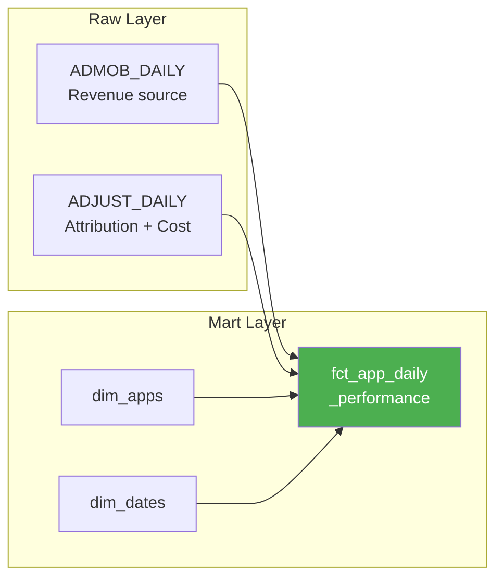

# Data Schema

Snowflake tables, columns, and SQL examples.



**Related docs:**
- `METRICS.md` - How to calculate metrics from this data
- `ARCHITECTURE.md` - How data flows through the system

---

## Migration Status

**Current:** dbt models use `RAW_MIDTEST` schema (midterm)
**Target:** dbt models use `RAW_CAPSTONE` schema with D0 metrics

### What's Missing in dbt

| Column | Source | Status |
|--------|--------|--------|
| ad_revenue_d0 | ADJUST_DAILY | In RAW_CAPSTONE, not in dbt |
| ad_impressions_d0 | ADJUST_DAILY | In RAW_CAPSTONE, not in dbt |
| network_cost | ADJUST_DAILY | In RAW_CAPSTONE, not in dbt |
| paid_impressions | ADJUST_DAILY | In RAW_CAPSTONE, not in dbt |
| subscrevnt_revenue | ADJUST_DAILY | In RAW_CAPSTONE, not in dbt |

### Migration Steps

1. Create new staging models pointing to RAW_CAPSTONE
2. Update intermediate model to include new columns
3. Update fact table with all metrics
4. Run `dbt build` and verify
5. Deprecate midtest models

---

## Raw Layer (RAW_CAPSTONE)

### ADMOB_DAILY

```sql
CREATE TABLE RAW_CAPSTONE.ADMOB_DAILY (
    RAW_RECORD_ID VARCHAR PRIMARY KEY,
    BATCH_ID VARCHAR,
    DATE VARCHAR,
    APP_STORE_ID VARCHAR,
    APP_NAME VARCHAR,
    COUNTRY_CODE VARCHAR,
    PLATFORM VARCHAR,
    ESTIMATED_EARNINGS NUMBER,
    AD_IMPRESSIONS NUMBER,
    AD_CLICKS NUMBER,
    AD_REQUESTS NUMBER,
    MATCHED_REQUESTS NUMBER,
    OBSERVED_ECPM NUMBER,
    LOADED_AT TIMESTAMP
);
```

**Source:** AdMob API (source of truth for revenue)
**Granularity:** app + country + platform + date
**Volume:** ~1,500 rows/day

### ADJUST_DAILY

```sql
CREATE TABLE RAW_CAPSTONE.ADJUST_DAILY (
    RAW_RECORD_ID VARCHAR PRIMARY KEY,
    BATCH_ID VARCHAR,
    DAY DATE,
    STORE_ID VARCHAR,
    APP VARCHAR,
    COUNTRY_CODE VARCHAR,
    OS_NAME VARCHAR,
    INSTALLS NUMBER,
    CLICKS NUMBER,
    DAUS NUMBER,
    AD_REVENUE NUMBER,
    AD_IMPRESSIONS NUMBER,
    AD_REVENUE_TOTAL_D0 NUMBER,
    AD_IMPRESSIONS_TOTAL_D0 NUMBER,
    NETWORK_COST NUMBER,
    PAID_IMPRESSIONS NUMBER,
    SUBSCREVNT_REVENUE NUMBER,
    LOADED_AT TIMESTAMP
);
```

**Source:** Adjust API (source of truth for attribution and cost)
**Granularity:** app + country + OS + date
**Volume:** ~4,000 rows/day

---

## Mart Layer (ANALYTICS)

### fct_app_daily_performance

```sql
SELECT
    performance_key,      -- MD5 surrogate key
    app_key,              -- FK to dim_apps
    date_key,             -- FK to dim_dates
    country_code,         -- Degenerate dimension
    platform,             -- Degenerate dimension

    -- AdMob metrics (source of truth for revenue)
    ad_revenue,
    ad_impressions,
    ad_clicks,
    ad_ctr,

    -- Adjust metrics
    installs,
    clicks,
    daus,

    -- D0 metrics (critical for ROAS)
    ad_revenue_d0,
    ad_impressions_d0,
    d0_revenue_pct,

    -- Cost & revenue
    network_cost,
    paid_impressions,
    subscrevnt_revenue,

    dbt_updated_at
FROM analytics.fct_app_daily_performance
```

**Grain:** One row per app × date × country × platform

### dim_apps

```sql
SELECT
    app_key,        -- MD5 surrogate key
    app_store_id,   -- Natural key (package ID)
    app_name        -- Display name
FROM analytics.dim_apps
```

### dim_dates

```sql
SELECT
    date_key,       -- MD5 surrogate key
    date,           -- Natural key
    year,
    month,
    day,
    day_of_week,
    day_name
FROM analytics.dim_dates
```

---

## Column Mapping

### AdMob → Fact Table

| ADMOB_DAILY | Maps to | Notes |
|-------------|---------|-------|
| ESTIMATED_EARNINGS | ad_revenue | Source of truth for money |
| AD_IMPRESSIONS | ad_impressions | For eCPM calculation |
| AD_CLICKS | ad_clicks | For CTR |
| APP_STORE_ID | app_key (via dim) | Join key |
| COUNTRY_CODE | country_code | Breakdown dimension |
| DATE | date_key (via dim) | Time dimension |
| PLATFORM | platform | iOS/Android |

### Adjust → Fact Table

| ADJUST_DAILY | Maps to | Notes |
|--------------|---------|-------|
| NETWORK_COST | network_cost | UA spend |
| INSTALLS | installs | New users |
| DAUS | daus | Active users |
| AD_REVENUE | (reconciliation only) | Compare with AdMob |
| AD_IMPRESSIONS | (reconciliation only) | Compare with AdMob |
| AD_REVENUE_TOTAL_D0 | ad_revenue_d0 | Day 0 revenue |
| AD_IMPRESSIONS_TOTAL_D0 | ad_impressions_d0 | Day 0 impressions |
| PAID_IMPRESSIONS | paid_impressions | UA impressions |
| SUBSCREVNT_REVENUE | subscrevnt_revenue | IAP revenue |
| STORE_ID | app_key (via dim) | Join key |
| COUNTRY_CODE | country_code | Breakdown dimension |
| DAY | date_key (via dim) | Time dimension |
| OS_NAME | platform | Standardized to iOS/Android |

---

## Join Keys

```python
# Matching AdMob and Adjust
AdMob.APP_STORE_ID == Adjust.STORE_ID
AdMob.DATE == Adjust.DAY
AdMob.COUNTRY_CODE == Adjust.COUNTRY_CODE  # case-insensitive
AdMob.PLATFORM == Adjust.OS_NAME           # standardize to iOS/Android
```

### Expected Variance

```
AdMob.ESTIMATED_EARNINGS ~ Adjust.AD_REVENUE     # 2-5% variance normal
AdMob.AD_IMPRESSIONS ~ Adjust.AD_IMPRESSIONS     # 2-5% variance normal
```

**Reasons for mismatch:** Timezones, attribution windows, network delays

---

## Example Queries

### Total Revenue This Week

```sql
SELECT SUM(ad_revenue) as total_revenue
FROM analytics.fct_app_daily_performance f
JOIN analytics.dim_dates d ON f.date_key = d.date_key
WHERE d.date >= DATEADD(day, -7, CURRENT_DATE())
```

### Top 5 Apps by Revenue

```sql
SELECT a.app_name, SUM(f.ad_revenue) as revenue
FROM analytics.fct_app_daily_performance f
JOIN analytics.dim_apps a ON f.app_key = a.app_key
GROUP BY a.app_name
ORDER BY revenue DESC
LIMIT 5
```

### D0 ROAS by Country

```sql
SELECT
    country_code,
    SUM(ad_revenue_d0) / NULLIF(SUM(network_cost), 0) as d0_roas
FROM analytics.fct_app_daily_performance
WHERE date >= CURRENT_DATE - 7
GROUP BY country_code
ORDER BY d0_roas DESC
```

### Revenue Reconciliation

```sql
WITH combined AS (
    SELECT
        a.date,
        a.app_store_id,
        a.country_code,
        a.estimated_earnings as admob_rev,
        j.ad_revenue as adjust_rev
    FROM raw_capstone.admob_daily a
    LEFT JOIN raw_capstone.adjust_daily j
        ON a.app_store_id = j.store_id
        AND a.date = j.day
        AND UPPER(a.country_code) = UPPER(j.country_code)
    WHERE a.date >= CURRENT_DATE - 7
)
SELECT
    date,
    SUM(admob_rev) as admob_total,
    SUM(adjust_rev) as adjust_total,
    ABS(SUM(adjust_rev) - SUM(admob_rev)) / NULLIF(SUM(admob_rev), 0) * 100 as diff_pct
FROM combined
GROUP BY date
ORDER BY date DESC
```

### Cost Analysis by App

```sql
SELECT
    a.app_name,
    SUM(f.network_cost) as total_cost,
    SUM(f.installs) as total_installs,
    SUM(f.network_cost) / NULLIF(SUM(f.installs), 0) as cpi,
    SUM(f.ad_revenue_d0) / NULLIF(SUM(f.network_cost), 0) as d0_roas
FROM analytics.fct_app_daily_performance f
JOIN analytics.dim_apps a ON f.app_key = a.app_key
WHERE f.network_cost > 0
GROUP BY a.app_name
ORDER BY total_cost DESC
```

---

## Data Volume

| Table | Daily Volume | Monthly |
|-------|--------------|---------|
| ADMOB_DAILY | ~1,500 rows | ~45K rows |
| ADJUST_DAILY | ~4,000 rows | ~120K rows |
| fct_app_daily_performance | ~4,000 rows | ~120K rows |

---

## Revision History

| Date | Change |
|------|--------|
| Jan 2026 | Restructured: moved metrics to METRICS.md, focused on schema |
