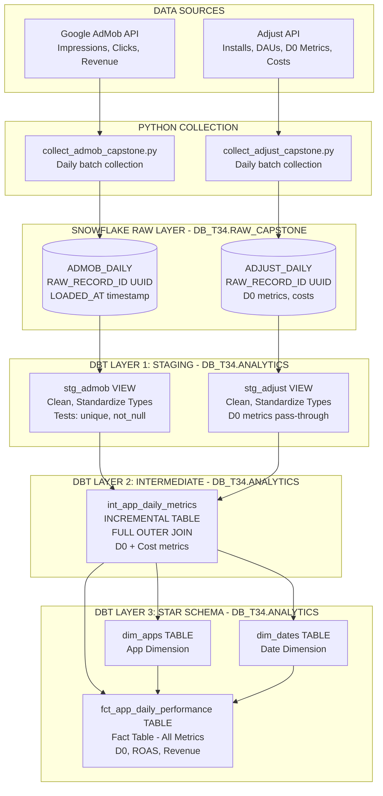
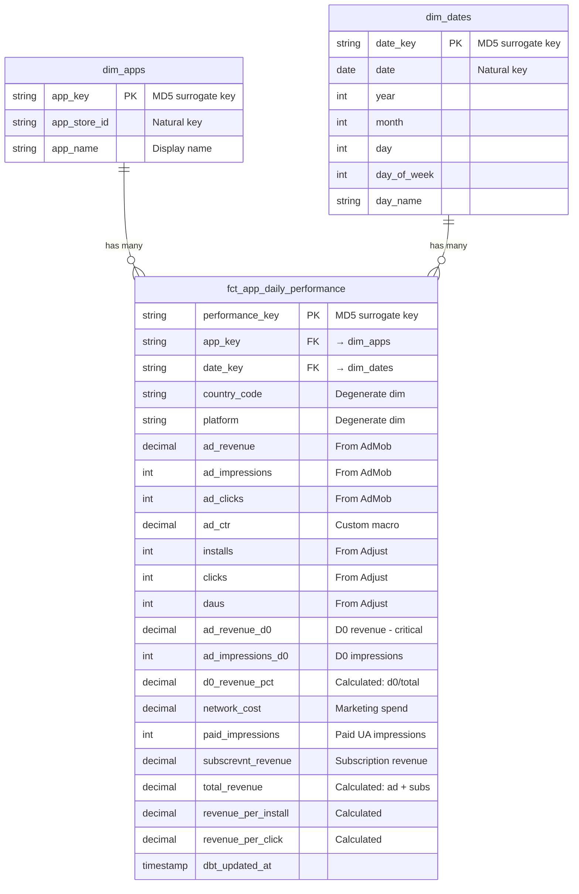
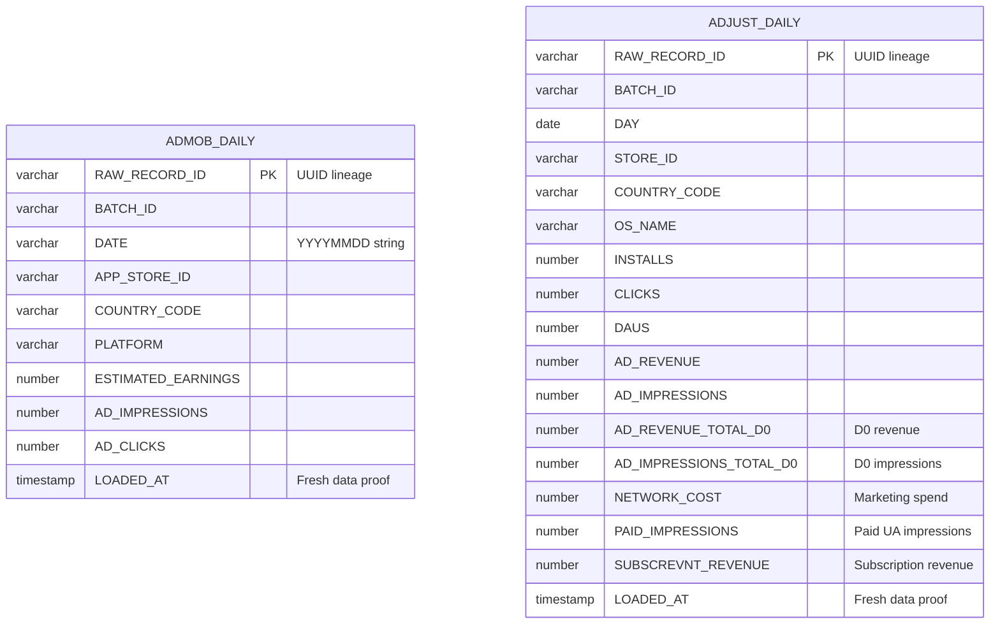
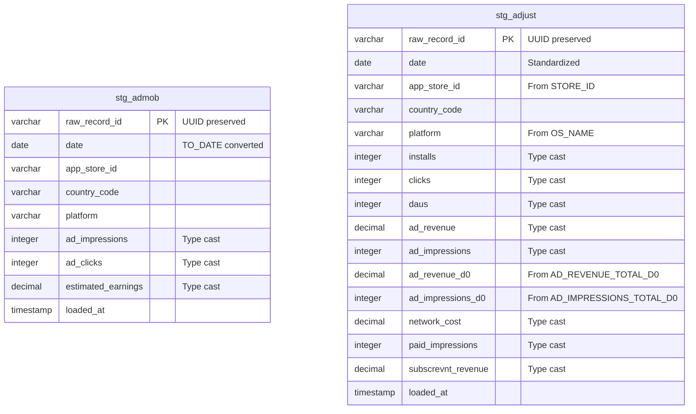
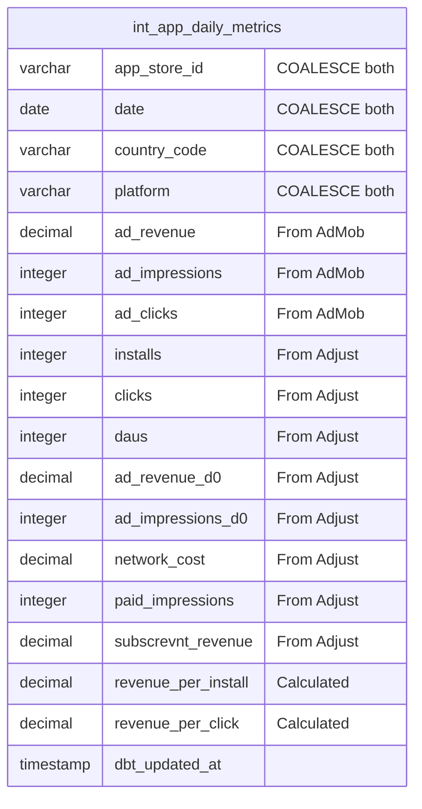
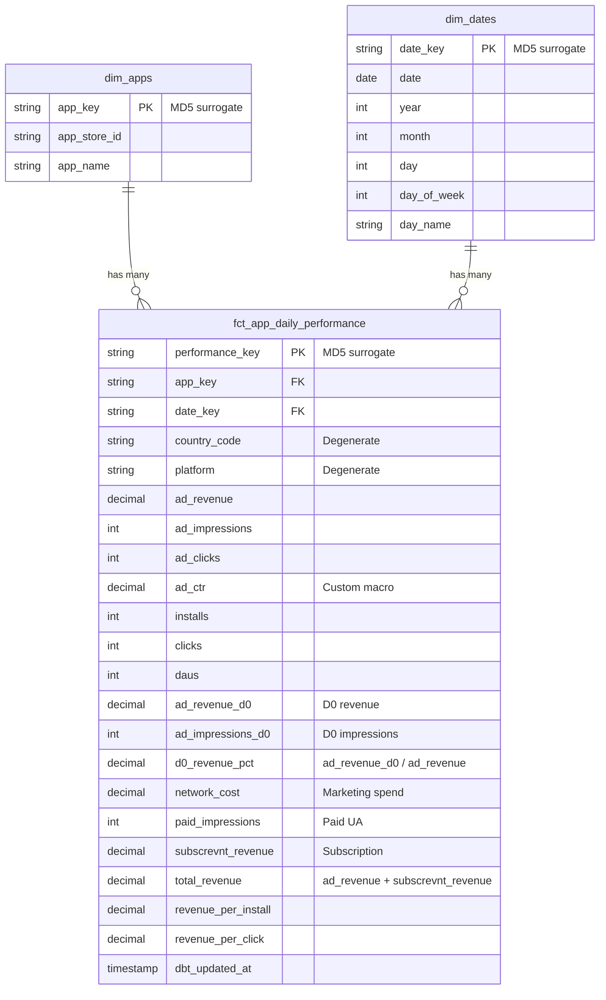

# Data Pipeline & Star Schema Architecture

**Schema:** `DB_T34.RAW_CAPSTONE` → `DB_T34.ANALYTICS`
**Updated:** January 2026

---

## Complete Data Flow

---

## Star Schema ERD

---

## Schema Evolution by Layer

### RAW LAYER: `DB_T34.RAW_CAPSTONE`

---

### STAGING LAYER: `DB_T34.ANALYTICS` (Views - Clean & Standardize)

**Transformations**: Date parsing, column renaming, type casting
**Tests**: unique(raw_record_id), not_null(raw_record_id, date, app_store_id)

---

### INTERMEDIATE LAYER: `DB_T34.ANALYTICS` (Incremental Table - Join & Calculate)

**Join**: FULL OUTER JOIN stg_admob ⟷ stg_adjust ON (app_store_id, date, country_code, platform)
**Incremental**: WHERE date > MAX(date)
**Unique Key**: [app_store_id, date, country_code, platform]

---

### MART LAYER: `DB_T34.ANALYTICS` (Star Schema - Analytics Ready)

**Grain**: One row per app per day per country per platform
**Surrogate Keys**: dbt_utils.generate_surrogate_key (MD5)
**Custom Macro**: calculate_ctr(clicks, impressions)
**Tests**: relationships(app_key → dim_apps), relationships(date_key → dim_dates)

---

## Transformation Layers Summary

| Layer | Models | Materialization | Purpose |
|-------|--------|-----------------|---------|
| **Staging** | stg_admob, stg_adjust | VIEW | Clean, standardize types, preserve UUID |
| **Intermediate** | int_app_daily_metrics | INCREMENTAL TABLE | FULL OUTER JOIN, combine sources |
| **Mart** | dim_apps, dim_dates, fct_app_daily_performance | TABLE | Star schema for analytics |

---

## Key Features

- **D0 Metrics**: Day 0 revenue/impressions for ROAS calculation (70-80% of revenue from install day)
- **Cost Tracking**: network_cost for ROI analysis
- **Revenue Streams**: ad_revenue + subscrevnt_revenue = total_revenue
- **Data Quality**: Tests for unique, not_null, relationships
- **Data Lineage**: UUID tracking from raw → staging
- **Performance**: Incremental materialization for efficiency
- **Custom Logic**: calculate_ctr() macro, d0_revenue_pct calculation
- **Star Schema**: Optimized for Snowflake analytics and AI Agent queries

---

## Key Metrics

| Metric | Formula | Business Use |
|--------|---------|--------------|
| **ROAS** | ad_revenue / network_cost | Return on ad spend |
| **D0 Revenue %** | ad_revenue_d0 / ad_revenue | Same-day payback |
| **eCPM** | (ad_revenue / ad_impressions) * 1000 | Ad efficiency |
| **CPI** | network_cost / installs | Cost per install |
| **ARPDAU** | ad_revenue / daus | Revenue per active user |
| **Total Revenue** | ad_revenue + subscrevnt_revenue | Full revenue picture |
