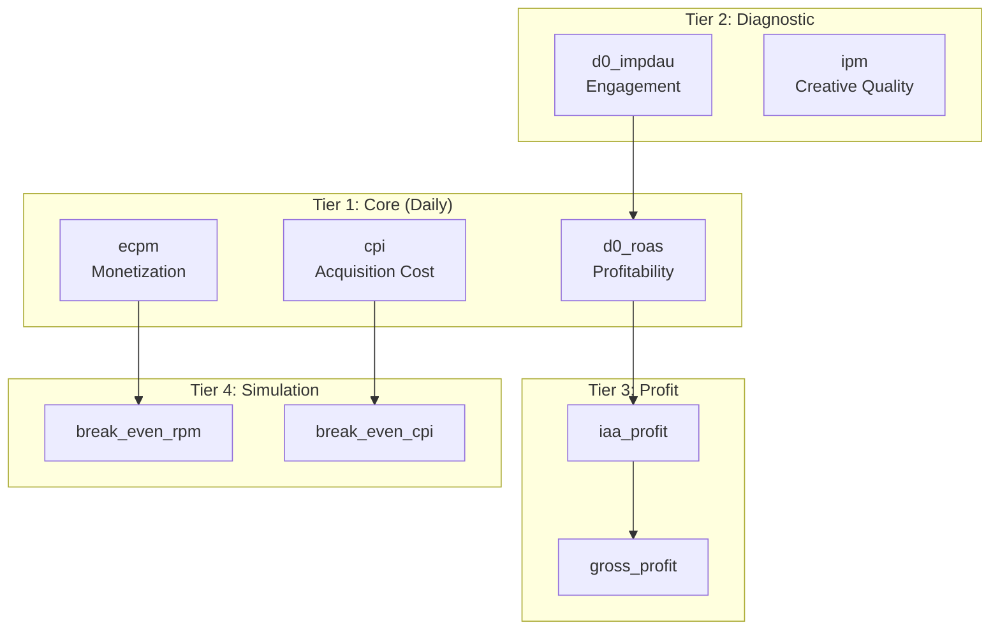

# Metrics Reference

Single source of truth for all metric calculations.



---

## Quick Reference

| Metric | Formula | Use Case |
|--------|---------|----------|
| **d0_roas** | ad_revenue_d0 / network_cost | Profitability indicator |
| **cpi** | network_cost / installs | User acquisition cost |
| **ecpm** | (admob_rev × 1000) / admob_imp | Monetization efficiency |
| **d0_impdau** | ad_impressions_d0 / daus | User engagement |
| **ipm** | (installs × 1000) / paid_impressions | Creative quality |
| **paid_ecpm** | (network_cost × 1000) / paid_impressions | UA cost efficiency |
| **d0_ltv** | ad_revenue_d0 / installs | Day 0 user value |
| **iaa_profit** | admob_rev - network_cost | Ad profit |
| **gross_profit** | admob_rev + subscrevnt_rev - network_cost | Total profit |

---

## Tier 1: Core Metrics (Daily Monitoring)

### ROAS (Return on Ad Spend)

```sql
d0_roas = ad_revenue_d0 / NULLIF(network_cost, 0)
```

**Why D0?** 70-80% of lifetime revenue comes from install day.

| Range | Interpretation | Action |
|-------|----------------|--------|
| > 120% | Excellent | Scale aggressively |
| 100-120% | Good | Maintain, monitor |
| 80-100% | Marginal | Check D7 retention |
| < 80% | Losing money | Pause or optimize |

**Company target:** 120% D0 ROAS

### CPI (Cost Per Install)

```sql
cpi = network_cost / NULLIF(installs, 0)
```

**Meaning:** Price to acquire one user.

**Factors affecting CPI:**
- Auction competition (more advertisers → higher CPI)
- Creative quality (higher CTR → lower CPI)
- Targeting precision (better audience → lower CPI)
- Seasonality (Q4 typically higher)

**Typical ranges:** US $1-3, SEA $0.10-0.30

### eCPM (Effective Cost Per Mille)

```sql
ecpm = (admob_rev * 1000) / NULLIF(admob_imp, 0)
```

**Meaning:** Revenue per 1,000 ad impressions.

**Factors affecting eCPM:**
- Country (US/EU high, SEA/Africa low)
- Ad format (rewarded video > interstitial > banner)
- Ad network demand
- User quality
- Seasonality (Q4 higher)

---

## Tier 2: Diagnostic Metrics (Drill-Down Analysis)

### IMPDAU (Impressions Per DAU)

```sql
d0_impdau = ad_impressions_d0 / NULLIF(daus, 0)
```

**Meaning:** Ads watched per user per day.

| Range | Interpretation |
|-------|----------------|
| < 2 | Low engagement (product issue) |
| 3-6 | Healthy |
| > 10 | Over-monetizing (user churn risk) |

### IPM (Installs Per Mille)

```sql
ipm = (installs * 1000) / NULLIF(paid_impressions, 0)
```

**Meaning:** Installs per 1,000 UA ad impressions.

**Use case:** Proxy for creative quality. High IPM = ads converting well.

**Relationship:** `CPI = paid_ecpm / IPM * 1000`

### paid_eCPM (UA Cost Per Mille)

```sql
paid_ecpm = (network_cost * 1000) / NULLIF(paid_impressions, 0)
```

**Meaning:** Cost to buy 1,000 impressions on ad networks.

### D0 LTV (Day 0 Lifetime Value)

```sql
d0_ltv = ad_revenue_d0 / NULLIF(installs, 0)
```

**Meaning:** Revenue generated per user on install day.

### ARPDAU (Average Revenue Per DAU)

```sql
arpdau = admob_rev / NULLIF(daus, 0)
```

**Meaning:** Daily revenue per active user.

---

## Tier 3: Profit Metrics

### IAA Profit (In-App Advertising)

```sql
iaa_profit = admob_rev - network_cost
```

**Meaning:** Profit from advertising business.

### IAP Revenue (In-App Purchases)

```sql
iap_revenue = subscrevnt_revenue
```

**Note:** SDK tracking not fully configured. Data may be incomplete.

### Gross Profit

```sql
gross_profit = admob_rev + subscrevnt_revenue - network_cost
```

**Meaning:** Total profit (IAA + IAP - Cost).

---

## Tier 4: Simulation Metrics (Break-Even Analysis)

### 100% D0 RPM (Break-Even RPM)

```sql
break_even_rpm = cpi * 1000 / NULLIF(d0_impdau, 0)
```

**Meaning:** RPM needed to achieve ROAS = 100%.

**Use case:** "With CPI=$0.15 and IMPDAU=4, need RPM=$37.5 to break even"

### 100% CPI (Break-Even CPI)

```sql
break_even_cpi = d0_rpm * d0_impdau / 1000
```

**Meaning:** Maximum CPI acceptable for break-even.

**Use case:** Set bid caps for UA team.

### Gap Analysis

```sql
rpm_gap = actual_rpm - break_even_rpm
-- Positive = profitable, Negative = losing

cpi_headroom = break_even_cpi - actual_cpi
-- Positive = room to bid higher, Negative = overbidding
```

---

## Tier 5: Data Quality Metrics

### Revenue Reconciliation

```sql
rev_diff_pct = ABS(adjust_rev - admob_rev) / NULLIF(admob_rev, 0) * 100
imp_diff_pct = ABS(adjust_imp - admob_imp) / NULLIF(admob_imp, 0) * 100
```

| Threshold | Status |
|-----------|--------|
| < 5% | Healthy |
| 5-10% | Warning |
| > 10% | Critical (investigate) |

**Common mismatch causes:**
- Timezone differences
- Attribution windows
- SDK firing issues
- Data pipeline delays

---

## The ROAS Equation

Understanding how metrics relate:

```
ROAS = Revenue / Cost

Expanded:
ROAS = (eCPM × IMPDAU) / (CPI × 1000)

Therefore:
- Higher eCPM → Higher ROAS
- Higher IMPDAU → Higher ROAS
- Lower CPI → Higher ROAS
```

**Business implication:** To improve ROAS, either:
1. Increase eCPM (better ad mediation, premium networks)
2. Increase IMPDAU (more ad placements, better engagement)
3. Decrease CPI (better targeting, better creatives)

---

## SQL Examples

### Calculate All Metrics for a Date

```sql
SELECT
    date,
    app_name,
    country_code,

    -- Core
    SUM(ad_revenue_d0) / NULLIF(SUM(network_cost), 0) as d0_roas,
    SUM(network_cost) / NULLIF(SUM(installs), 0) as cpi,
    SUM(ad_revenue) * 1000 / NULLIF(SUM(ad_impressions), 0) as ecpm,

    -- Diagnostic
    SUM(ad_impressions_d0) / NULLIF(SUM(daus), 0) as d0_impdau,
    SUM(installs) * 1000 / NULLIF(SUM(paid_impressions), 0) as ipm,

    -- Profit
    SUM(ad_revenue) - SUM(network_cost) as iaa_profit

FROM analytics.fct_app_daily_performance f
JOIN analytics.dim_apps a ON f.app_key = a.app_key
WHERE date = CURRENT_DATE - 1
GROUP BY date, app_name, country_code
ORDER BY iaa_profit DESC;
```

### Break-Even Analysis

```sql
WITH metrics AS (
    SELECT
        country_code,
        SUM(network_cost) / NULLIF(SUM(installs), 0) as cpi,
        SUM(ad_revenue_d0) * 1000 / NULLIF(SUM(ad_impressions_d0), 0) as d0_rpm,
        SUM(ad_impressions_d0) / NULLIF(SUM(daus), 0) as d0_impdau
    FROM analytics.fct_app_daily_performance
    WHERE date >= CURRENT_DATE - 7
    GROUP BY country_code
)
SELECT
    country_code,
    ROUND(cpi, 3) as actual_cpi,
    ROUND(d0_rpm * d0_impdau / 1000, 3) as break_even_cpi,
    ROUND(d0_rpm * d0_impdau / 1000 - cpi, 3) as cpi_headroom
FROM metrics
ORDER BY cpi_headroom DESC;
```

---

## Source Data Mapping

| Metric | Source Table | Column |
|--------|--------------|--------|
| admob_rev | ADMOB_DAILY | ESTIMATED_EARNINGS |
| admob_imp | ADMOB_DAILY | AD_IMPRESSIONS |
| ad_revenue_d0 | ADJUST_DAILY | AD_REVENUE_TOTAL_D0 |
| ad_impressions_d0 | ADJUST_DAILY | AD_IMPRESSIONS_TOTAL_D0 |
| network_cost | ADJUST_DAILY | NETWORK_COST |
| installs | ADJUST_DAILY | INSTALLS |
| daus | ADJUST_DAILY | DAUS |
| paid_impressions | ADJUST_DAILY | PAID_IMPRESSIONS |
| subscrevnt_revenue | ADJUST_DAILY | SUBSCREVNT_REVENUE |

**Note:** AdMob = source of truth for revenue. Adjust = source of truth for attribution and cost.

---

## Revision History

| Date | Change |
|------|--------|
| Jan 2026 | Created as single source of truth for metrics |
