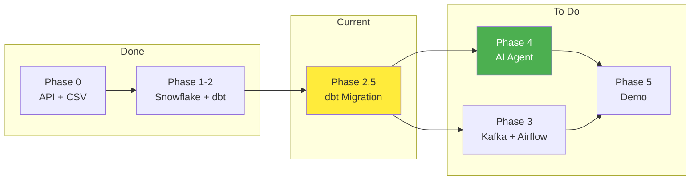

# Project Plan

What to do, in what order, and current status.



**Related docs:**
- `AI_AGENT_SPEC.md` - Who uses the system and what they need
- `DASHBOARD_SPEC.md` - What to build (dashboards, agent capabilities)
- `ARCHITECTURE.md` - How the system works technically

---

## Goal

**Executive Decision Support Agent for Ameno Technologies**

AI chatbot that queries real AdMob/Adjust data to answer business questions for executives without SQL knowledge.

**Primary User:** Chi Linh (Business Performance Controller)
**Deadline:** January 24, 2026

---

## System Architecture

**Three Independent Systems → One Agent**

```
┌─────────────────────────────────────────────────────────────────┐
│                     AI AGENT (Orchestrator)                     │
│              LangGraph + Memory + Business Context              │
└─────────────────────────────────────────────────────────────────┘
        │                    │                    │
        ▼                    ▼                    ▼
┌───────────────┐   ┌───────────────┐   ┌───────────────┐
│  BATCH DATA   │   │  STREAMING    │   │     RAG       │
│  (Snowflake)  │   │  (Kafka)      │   │   (Docs)      │
├───────────────┤   ├───────────────┤   ├───────────────┤
│ Real data     │   │ Fake data     │   │ Any PDF       │
│ dbt transform │   │ Local Docker  │   │ Vector store  │
│ BUSINESS VALUE│   │ CHECKBOX      │   │ CHECKBOX      │
└───────────────┘   └───────────────┘   └───────────────┘
```

**Key:** Kafka and RAG are independent checkbox items. Use fake/fabricated data. Agent ties them together at demo.

---

## Project Status

| Phase | Description | Status | Points |
|-------|-------------|--------|--------|
| Phase 0 | API Client + CSV | Done | - |
| Phase 1-2 | Snowflake + dbt | Done | 30 |
| Phase 2.5 | Full Portfolio + LTV Curve (D0-D7) | **IN PROGRESS** | - |
| Phase 3 | Kafka + Airflow (checkbox) | To Do | 15 |
| Phase 4 | AI Agent | Priority | 20 |
| Phase 5 | Docs + Demo | To Do | 10 |

**Midterm:** 75/100 | **Final:** January 24, 2026 | **Target:** 80+ points

---

## Grading Breakdown

| Section | Points | System |
|---------|--------|--------|
| Data Ingestion & Orchestration | 15 | Kafka + Airflow (checkbox) |
| Data Modeling & Transformation | 15 | dbt (core) |
| DevOps & CI | 5 | GitHub Actions |
| Documentation | 5 | README + diagrams |
| AI Agent (RAG + memory) | 10 | RAG checkbox + Agent |
| AI Agent (data querying) | 10 | Snowflake tools (core) |
| **Extra Features** | **40** | **Advanced agent + business context** |

**Pass:** 50 points | **Target:** 80+ points

---

## Phase 2.5: Full Portfolio + LTV Curve

**Prerequisite for AI Agent. Extends D0-only to full D0-D7 cohort metrics.**

### What Changed

| Before (Midtest) | After (Capstone) |
|------------------|------------------|
| 3 filtered apps | 45+ apps (full portfolio) |
| D0 metrics only | D0, D1, D3, D7 cohorts |
| ~1,500 rows/day | ~4,000 rows/day |

### Checklist

**dbt Models (Completed):**
- [x] Create `stg_admob_capstone.sql` → RAW_CAPSTONE.ADMOB_DAILY
- [x] Create `stg_adjust_capstone.sql` → RAW_CAPSTONE.ADJUST_DAILY
- [x] Add D0, D1, D3, D7 cohort columns to all models
- [x] Add network_cost, paid_impressions, subscrevnt_revenue
- [x] Update schema.yml with new column documentation

**Collection Scripts:**
- [x] Update `collect_adjust_capstone.py` - add D1, D3, D7 metrics
- [x] Update `collect_adjust_capstone.py` - remove TARGET_APPS filter
- [ ] Update `collect_admob_capstone.py` - remove TARGET_APPS filter

**Data Load:**
- [ ] Clear RAW_CAPSTONE tables
- [ ] Re-collect full portfolio data
- [ ] Run `dbt build --full-refresh`
- [ ] Verify data in Snowflake

### Decision Log

| Decision | Choice | Reasoning |
|----------|--------|-----------|
| Schema | Star + fact table | Industry standard, good for analytics |
| Layers | 3 (staging/int/mart) | Clear separation, debuggable |
| Materialization | Keep incremental | Required by grading |
| Cohort metrics | D0, D1, D3, D7 | Covers ~95% of LTV, practical for analysis |
| Full portfolio | All apps, all countries | Production-realistic data |

---

## Phase 3: Kafka + Airflow (Checkbox)

**Minimal implementation. Independent from main flow.**

### Kafka Checklist

- [ ] `kafka/docker-compose.yml` - Kafka + Zookeeper
- [ ] `kafka/producer.py` - Generate fake metrics
- [ ] `kafka/consumer.py` - Read and print/store
- [ ] Test: Producer sends, consumer receives
- [ ] `agent/tools/kafka_tools.py` - Query latest data

**NOT required:** Push to Snowflake, integrate with batch flow

### Airflow Checklist

- [ ] Docker setup for Airflow
- [ ] `dags/dbt_pipeline.py` with 3 tasks:
  - [ ] collect data (or skip if manual)
  - [ ] dbt run
  - [ ] dbt test
- [ ] Schedule daily
- [ ] Test: DAG runs successfully

### Course Materials

```
/Users/lehongthai/code_personal/fa-c002-hub/content/
├── M03/W01/M03W01L03__lab_capstone_kafka_setup.md
├── M03/W02/M03W02L03__lab_capstone_airflow_setup.md
└── M03/W03/M03W03L03__lab_capstone_dbt_dag.md
```

---

## Phase 4: AI Agent (Priority)

**This is where business value and extra points come from.**

### System 1: Batch Data Querying (Core - 10 pts)

- [ ] `agent/tools/snowflake_tools.py`:
  - [ ] query_metrics - Execute SQL on fact table
  - [ ] compare_periods - Compare two time ranges
  - [ ] drill_down - Breakdown by dimension
- [ ] Test: Answer chi Linh's 10 questions accurately

### System 2: RAG Documents (Checkbox - 5 pts)

- [ ] `agent/rag/document_loader.py` - Load PDFs
- [ ] `agent/rag/vector_store.py` - Embed with Chroma/FAISS
- [ ] `agent/tools/rag_tools.py` - Retrieval tool
- [ ] Test: Query a document, get relevant answer

### System 3: Streaming (Checkbox - 5 pts)

- [ ] `agent/tools/kafka_tools.py` - Query latest Kafka data
- [ ] Test: Agent returns latest streaming metric

### Agent Orchestration (Extra Points)

- [ ] `agent/agent.py` - LangGraph state graph
- [ ] System prompt with:
  - [ ] Metric definitions
  - [ ] Chi Linh's thresholds
  - [ ] Drill-down hierarchy
- [ ] Memory for conversation context
- [ ] `agent/app.py` - Streamlit UI

See `DASHBOARD_SPEC.md` for detailed capabilities and phases.

### Course Materials

```
/Users/lehongthai/code_personal/fa-c002-hub/content/
├── M04/W01/M04W01L03__lab_ai_agents_with_langgraph.md  # START HERE
├── M04/W02/M04W02L03__lab_snowflake_tools.md           # Query tools
└── M04/W03/M04W03L04__lab_rag_system.md                # RAG system
```

---

## Phase 5: Documentation & Demo

### Checklist

- [ ] README.md with architecture diagram
- [ ] Clear setup instructions
- [ ] Demo script with scenarios

### Demo Must Show

- [ ] Kafka producer running (streaming)
- [ ] Airflow DAG execution (dbt run)
- [ ] GitHub Actions passing
- [ ] Agent with conversation memory
- [ ] RAG document query
- [ ] Batch data query
- [ ] Combined query (bonus)

---

## Priority Order

1. **Phase 2.5 (dbt migration)** - Prerequisite, do first
2. **Phase 4 (AI Agent)** - Business value + extra points
3. **Phase 3 (Kafka + Airflow)** - Checkbox, minimal
4. **Phase 5 (Docs + Demo)** - Polish

---

## Quick Commands

```bash
# Activate environment
cd /Users/lehongthai/code_personal/fa-c002-lab
source .venv/bin/activate

# Data collection
python scripts/collect_adjust_capstone.py --days 3
python scripts/collect_admob_capstone.py --days 3

# dbt pipeline
cd my_dbt_project && dbt build
```

---

## Revision History

| Date | Change |
|------|--------|
| Jan 2026 | Added execution checklists, restructured phases |
