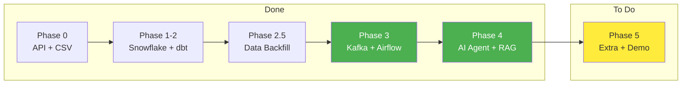

# Project Plan

What to do, in what order, and current status.



**Related docs:**
- `AI_AGENT_SPEC.md` - Who uses the system and what they need
- `ARCHITECTURE.md` - How the system works technically
- `DEMO_FLOW.md` - Demo day script and checklist

---

## Goal

**Executive Decision Support Agent for Ameno Technologies**

AI chatbot that queries real AdMob/Adjust data to answer business questions for executives without SQL knowledge.

**Primary User:** Chi Linh (Business Performance Controller)
**Deadline:** January 24, 2026
**Target:** 85+ points

---

## Current Status

| Phase | Description | Status | Points |
|-------|-------------|--------|--------|
| Phase 0-2 | API + Snowflake + dbt | DONE | 30 |
| Phase 2.5 | Data Backfill (29 days) | DONE | - |
| Phase 3 | Kafka Streaming | DONE | 7.5 |
| Phase 3 | Airflow Orchestration | DONE | 7.5 |
| Phase 4 | AI Agent Core | DONE | 10 |
| Phase 4 | RAG Tool | DONE | 10 |
| Extra | dbt Macros, Tests | TO DO | 20+ |

**Current Score:** ~80 pts | **Target:** 85+ pts

---

## System Architecture

**Three Independent Systems → One Agent**

```
┌─────────────────────────────────────────────────────────────────┐
│                     AI AGENT (Orchestrator)                     │
│              LangGraph + Memory + Business Context              │
│                                                                 │
│   ┌─────────────────┐ ┌─────────────────┐ ┌─────────────────┐  │
│   │ query_snowflake │ │ query_realtime  │ │ search_business │  │
│   │                 │ │ _alerts         │ │ _documents      │  │
│   └─────────────────┘ └─────────────────┘ └─────────────────┘  │
└─────────────────────────────────────────────────────────────────┘
        │                    │                    │
        ▼                    ▼                    ▼
┌───────────────┐   ┌───────────────┐   ┌───────────────┐
│  BATCH DATA   │   │  STREAMING    │   │     RAG       │
│  (Snowflake)  │   │  (Kafka)      │   │   (FAISS)     │
├───────────────┤   ├───────────────┤   ├───────────────┤
│ Real data     │   │ Fake alerts   │   │ Business rules│
│ dbt transform │   │ PostgreSQL    │   │ OpenAI embed  │
│ DONE ✓        │   │ DONE ✓        │   │ DONE ✓        │
└───────────────┘   └───────────────┘   └───────────────┘
```

---

## Completed Work

### Phase 4: AI Agent + RAG - DONE

**Agent Files:**
| File | Description |
|------|-------------|
| `agent/config.py` | OpenAI configuration (loads from .env) |
| `agent/prompts.py` | System prompt with 3-tool guidance |
| `agent/agent.py` | LangGraph state machine with memory |
| `agent/app.py` | Streamlit UI for demo |

**Three Tools:**
| Tool | File | Purpose |
|------|------|---------|
| `query_snowflake` | `agent/tools/snowflake_tools.py` | Query batch data from Snowflake |
| `query_realtime_alerts` | `agent/tools/kafka_tools.py` | Query streaming alerts from PostgreSQL |
| `search_business_documents` | `agent/tools/rag_tools.py` | Search business rules via FAISS |

**RAG Implementation:**
| Component | Location | Description |
|-----------|----------|-------------|
| Business Rules | `docs/business_rules/ameno_business_rules.md` | ROAS thresholds, CPI benchmarks, alert definitions |
| Vector Store | `agent/vector_store/` | FAISS index (auto-generated on first query) |
| Demo Script | `agent/rag_demo.py` | Interactive demo showing chunking + embedding |

**Test Results (9/10 Chi Linh Questions):**
- Top spending app: PASS
- Why metrics changed: PASS
- D0 ROAS by country: PASS
- Revenue breakdown: PASS
- CPI analysis: PARTIAL (data gaps)
- Break-even analysis: PASS

### Phase 3: Kafka + Airflow - DONE

**Kafka Streaming:**
| File | Description |
|------|-------------|
| `kafka/docker-compose.yml` | Kafka (KRaft mode) + PostgreSQL containers |
| `kafka/producer.py` | Generates fake alerts (supports `--batch N --interval 0`) |
| `kafka/consumer.py` | Writes alerts to PostgreSQL (port 5433) |

**Airflow Orchestration:**
| File | Description |
|------|-------------|
| `airflow/docker-compose.yml` | Airflow (LocalExecutor) + PostgreSQL |
| `airflow/Dockerfile` | Custom image with dbt-snowflake |
| `airflow/dags/dbt_pipeline.py` | 3 tasks: dbt_debug → dbt_run → dbt_test |
| `airflow/profiles.yml` | dbt profile for Docker environment |

**Alert Types Generated:**
- SPEND_SPIKE: Unusual spending pattern
- ROAS_DROP: Return on ad spend decreased
- INSTALL_SURGE: Unusual install volume
- ERROR_RATE: System errors detected

### Phase 2.5: Data Backfill - DONE

| Metric | Value |
|--------|-------|
| Date range | Dec 25, 2025 → Jan 22, 2026 (29 days) |
| ADJUST_DAILY | 122,895 rows |
| ADMOB_DAILY | 109,594 rows |
| fct_app_daily_performance | 140,546 rows |
| dim_apps | 59 apps |

---

## Remaining Work

### Priority 1: Extra Features (20+ pts)

| Feature | Points | Status |
|---------|--------|--------|
| dbt Macros (ROAS, CPI, eCPM) | 10-15 | TO DO |
| dbt-expectations tests | 10-15 | TO DO |

### Priority 2: Demo Preparation

- [ ] Collect fresh data (Jan 23-24)
- [ ] Run dbt build with fresh data
- [ ] Test all three agent tools
- [ ] Practice demo script

---

## Quick Commands

```bash
# Start all services
cd kafka && docker-compose up -d
cd ../airflow && docker-compose up -d

# Generate fresh streaming alerts
uv run python kafka/producer.py --batch 20 --interval 0

# Run dbt
cd my_dbt_project && dbt build

# Test agent (CLI)
uv run python -m agent.agent -q "What's total revenue this week?"
uv run python -m agent.agent -q "Show me recent alerts"
uv run python -m agent.agent -q "What are ROAS thresholds for scaling?"

# Interactive mode
uv run python -m agent.agent --interactive

# Start Streamlit UI
uv run streamlit run agent/app.py

# RAG demo (explains chunking + embedding)
uv run python agent/rag_demo.py
```

---

## Running Services

| Service | URL/Port | Credentials |
|---------|----------|-------------|
| Airflow UI | http://localhost:8080 | admin / admin |
| Kafka | localhost:29092 | - |
| Streaming PostgreSQL | localhost:5433 | capstone / capstone123 |
| Airflow PostgreSQL | localhost:5434 | airflow / airflow |

---

## Project Structure

```
fa-c002-lab/
├── agent/                        # AI Agent (Phase 4) - DONE
│   ├── config.py                 # OpenAI configuration
│   ├── prompts.py                # System prompt with business context
│   ├── agent.py                  # LangGraph state machine
│   ├── app.py                    # Streamlit UI
│   ├── rag_demo.py               # RAG explanation demo
│   ├── vector_store/             # FAISS index (auto-generated)
│   └── tools/
│       ├── snowflake_tools.py    # Batch data queries
│       ├── kafka_tools.py        # Real-time alerts
│       └── rag_tools.py          # Document search
├── kafka/                        # Streaming (Phase 3) - DONE
│   ├── docker-compose.yml        # Kafka + PostgreSQL
│   ├── producer.py               # Alert generator
│   └── consumer.py               # PostgreSQL sink
├── airflow/                      # Orchestration (Phase 3) - DONE
│   ├── docker-compose.yml        # Airflow + PostgreSQL
│   ├── Dockerfile                # Custom image with dbt
│   ├── profiles.yml              # dbt profile
│   └── dags/
│       └── dbt_pipeline.py       # debug → run → test
├── my_dbt_project/               # Transformation - DONE
│   └── models/
│       ├── 01_staging/
│       ├── 02_intermediate/
│       └── 03_mart/
├── scripts/                      # Data collection - DONE
│   ├── collect_adjust_capstone.py
│   └── collect_admob_capstone.py
├── docs/
│   ├── business_rules/           # RAG documents
│   │   └── ameno_business_rules.md
│   ├── PROJECT_PLAN.md           # This file
│   ├── DEMO_FLOW.md              # Demo script
│   ├── ARCHITECTURE.md           # Technical details
│   └── ...
└── .github/workflows/
    └── dbt_ci.yml                # SQLFluff + dbt test
```

---

## Revision History

| Date | Change |
|------|--------|
| Jan 24, 2026 | RAG tool complete, all 3 agent tools working |
| Jan 24, 2026 | Kafka + Airflow complete |
| Jan 23, 2026 | AI Agent core complete (9/10 questions pass) |
| Jan 22, 2026 | Data backfill complete (140K rows) |
