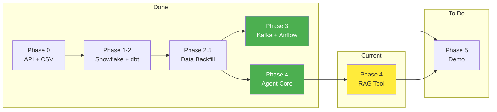

# Project Plan

What to do, in what order, and current status.



**Related docs:**
- `AI_AGENT_SPEC.md` - Who uses the system and what they need
- `ARCHITECTURE.md` - How the system works technically
- `DEMO_FLOW.md` - Demo day script and checklist

---

## Goal

**Executive Decision Support Agent for Ameno Technologies**

AI chatbot that queries real AdMob/Adjust data to answer business questions for executives without SQL knowledge.

**Primary User:** Chi Linh (Business Performance Controller)
**Deadline:** January 24, 2026
**Target:** 85+ points

---

## Current Status

| Phase | Description | Status | Points |
|-------|-------------|--------|--------|
| Phase 0-2 | API + Snowflake + dbt | DONE | 30 |
| Phase 2.5 | Data Backfill (29 days) | DONE | - |
| Phase 3 | Kafka Streaming | DONE | 7.5 |
| Phase 3 | Airflow Orchestration | DONE | 7.5 |
| Phase 4 | AI Agent Core | DONE | 10 |
| Phase 4 | RAG Tool | **IN PROGRESS** | 10 |
| Extra | dbt Macros, Tests | TO DO | 20+ |

**Current Score:** ~70 pts | **Target:** 85+ pts

---

## System Architecture

**Three Independent Systems → One Agent**

```
┌─────────────────────────────────────────────────────────────────┐
│                     AI AGENT (Orchestrator)                     │
│              LangGraph + Memory + Business Context              │
└─────────────────────────────────────────────────────────────────┘
        │                    │                    │
        ▼                    ▼                    ▼
┌───────────────┐   ┌───────────────┐   ┌───────────────┐
│  BATCH DATA   │   │  STREAMING    │   │     RAG       │
│  (Snowflake)  │   │  (Kafka)      │   │   (Docs)      │
├───────────────┤   ├───────────────┤   ├───────────────┤
│ Real data     │   │ Fake alerts   │   │ PDF docs      │
│ dbt transform │   │ PostgreSQL    │   │ FAISS store   │
│ CORE VALUE    │   │ DONE ✓        │   │ TO DO         │
└───────────────┘   └───────────────┘   └───────────────┘
```

---

## Completed Work

### Phase 3: Kafka + Airflow - DONE

**Kafka Streaming:**
- `kafka/docker-compose.yml` - Kafka (KRaft) + PostgreSQL containers
- `kafka/producer.py` - Generates fake alerts (batch mode available)
- `kafka/consumer.py` - Writes alerts to PostgreSQL (port 5433)
- `agent/tools/kafka_tools.py` - Agent queries PostgreSQL alerts
- **51 alerts** currently in streaming database

**Airflow Orchestration:**
- `airflow/docker-compose.yml` - Airflow (LocalExecutor) + PostgreSQL
- `airflow/dags/dbt_pipeline.py` - 3 tasks: debug → run → test
- `airflow/Dockerfile` - Custom image with dbt-snowflake
- DAG loaded and ready at http://localhost:8080

### Phase 4: AI Agent Core - DONE

**Files Created:**
- `agent/config.py` - OpenAI configuration
- `agent/prompts.py` - System prompt with business context
- `agent/agent.py` - LangGraph state machine
- `agent/app.py` - Streamlit UI
- `agent/tools/snowflake_tools.py` - Snowflake query tool
- `agent/tools/kafka_tools.py` - Real-time alerts tool

**Test Results (9/10 Chi Linh Questions):**
- Top spending app: PASS
- Why metrics changed: PASS
- D0 ROAS by country: PASS
- Revenue breakdown: PASS
- CPI analysis: PARTIAL
- Break-even analysis: PASS

### Phase 2.5: Data Backfill - DONE

| Metric | Value |
|--------|-------|
| Date range | Dec 25, 2025 → Jan 22, 2026 (29 days) |
| ADJUST_DAILY | 122,895 rows |
| ADMOB_DAILY | 109,594 rows |
| fct_app_daily_performance | 140,546 rows |
| dim_apps | 59 apps |

---

## Remaining Work

### Priority 1: RAG Tool (10 pts)

```
agent/tools/rag_tools.py    # FAISS-based document search
docs/Business_Rules.pdf      # Sample doc for demo
docs/vector_store/           # FAISS index
```

### Priority 2: Extra Features (20+ pts)

| Feature | Points | Status |
|---------|--------|--------|
| dbt Macros (ROAS, CPI, eCPM) | 10-15 | TO DO |
| dbt-expectations tests | 10-15 | TO DO |
| Document prompts | 5-10 | Partial |

---

## Quick Commands

```bash
# Start all services
cd kafka && docker-compose up -d
cd airflow && docker-compose up -d

# Generate fresh alerts
uv run python kafka/producer.py --batch 20 --interval 0

# Run dbt
cd my_dbt_project && dbt build

# Test agent
uv run python -m agent.agent -q "Show me recent alerts"
uv run python -m agent.agent -q "What's total revenue this week?"

# Start Streamlit UI
uv run streamlit run agent/app.py
```

---

## Running Services

| Service | URL/Port | Credentials |
|---------|----------|-------------|
| Airflow UI | http://localhost:8080 | admin / admin |
| Kafka | localhost:29092 | - |
| Streaming PostgreSQL | localhost:5433 | capstone / capstone123 |
| Airflow PostgreSQL | localhost:5434 | airflow / airflow |

---

## Revision History

| Date | Change |
|------|--------|
| Jan 24, 2026 | Kafka + Airflow complete, updated status |
| Jan 23, 2026 | AI Agent core complete (9/10 questions pass) |
| Jan 22, 2026 | Data backfill complete (140K rows) |
