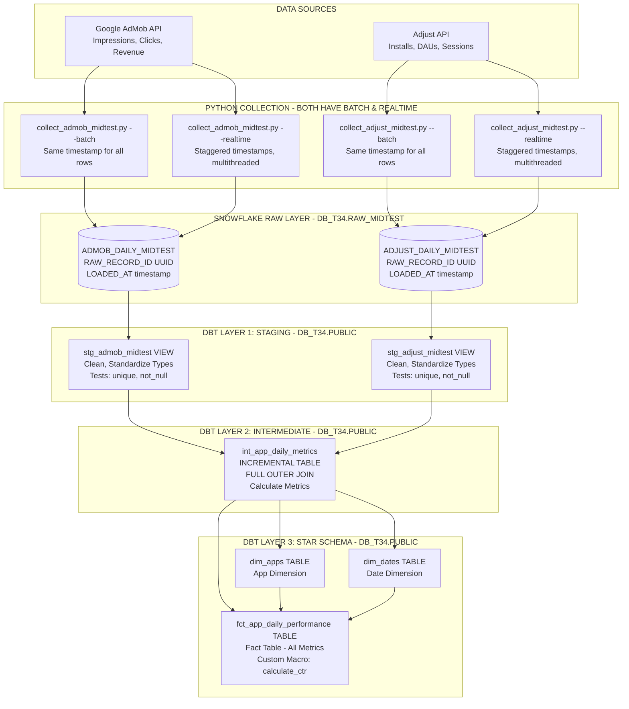
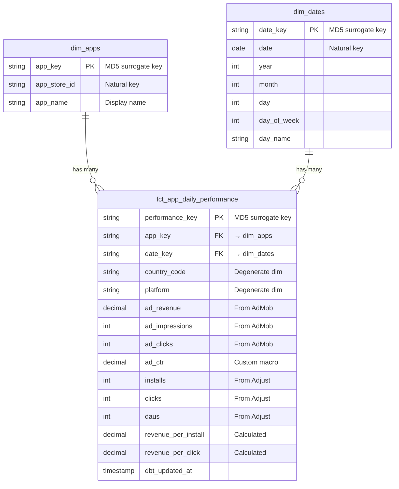
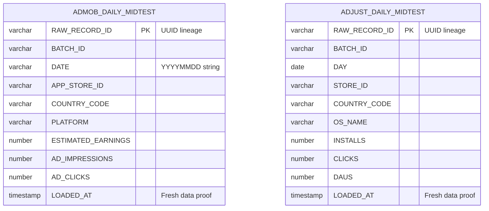
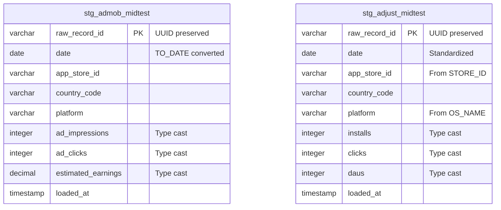
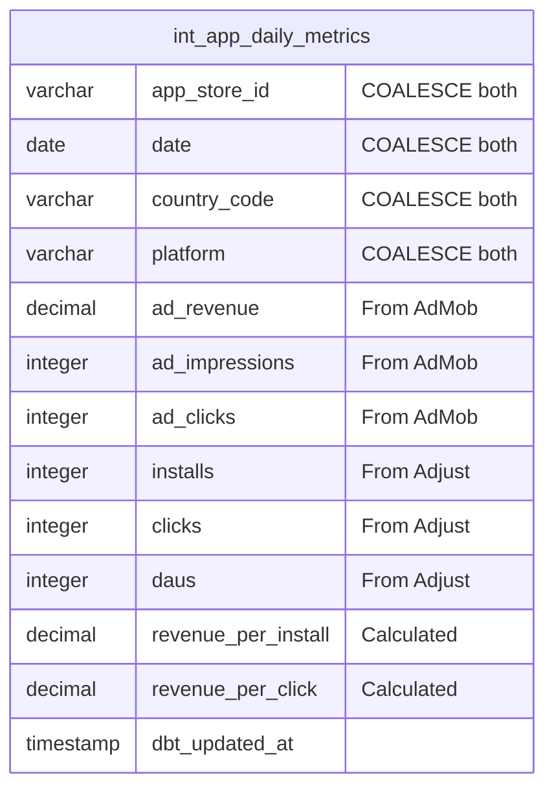
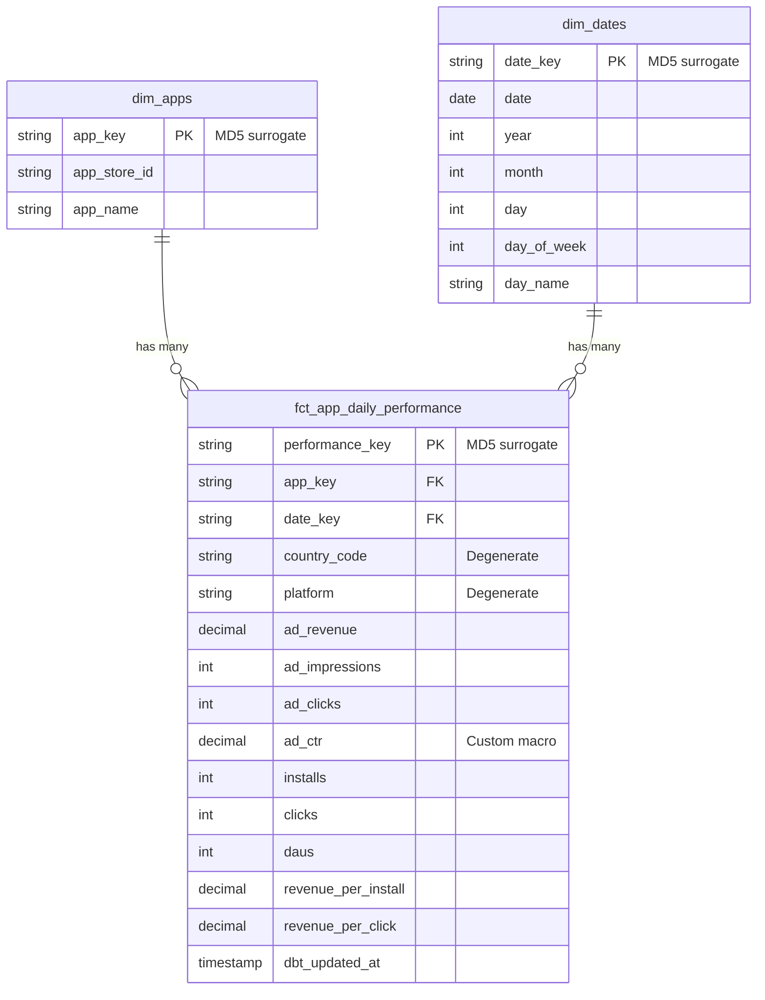

# Data Pipeline & Star Schema Architecture

## Complete Data Flow

---

## Star Schema ERD

---

## Schema Evolution by Layer

### RAW LAYER: `DB_T34.RAW_MIDTEST`

---

### STAGING LAYER: `DB_T34.PUBLIC` (Views - Clean & Standardize)

**Transformations**: Date parsing, column renaming, type casting
**Tests**: unique(raw_record_id), not_null(raw_record_id, date, app_store_id)

---

### INTERMEDIATE LAYER: `DB_T34.PUBLIC` (Incremental Table - Join & Calculate)

**Join**: FULL OUTER JOIN stg_admob ⟷ stg_adjust ON (app_store_id, date, country_code)
**Incremental**: WHERE date > MAX(date)
**Unique Key**: [app_store_id, date, country_code]

---

### MART LAYER: `DB_T34.PUBLIC` (Star Schema - Analytics Ready)

**Grain**: One row per app per day per country per platform
**Surrogate Keys**: dbt_utils.generate_surrogate_key (MD5)
**Custom Macro**: calculate_ctr(clicks, impressions)
**Tests**: relationships(app_key → dim_apps), relationships(date_key → dim_dates)

---

## Transformation Layers

| Layer | Models | Materialization | Purpose |
|-------|--------|-----------------|---------|
| **Staging** | stg_admob_midtest stg_adjust_midtest | VIEW | Clean, standardize types, preserve UUID |
| **Intermediate** | int_app_daily_metrics | INCREMENTAL TABLE | FULL OUTER JOIN, calculate metrics |
| **Mart** | dim_apps dim_dates fct_app_daily_performance | TABLE | Star schema for analytics |

---

## Key Features

- **Data Collection**: Both AdMob & Adjust have --batch and --realtime modes
- **Data Quality**: 27 tests (unique, not_null, relationships)
- **Data Lineage**: UUID tracking from raw → staging
- **Performance**: Incremental materialization
- **Custom Logic**: calculate_ctr() macro
- **Star Schema**: Optimized for Snowflake analytics
