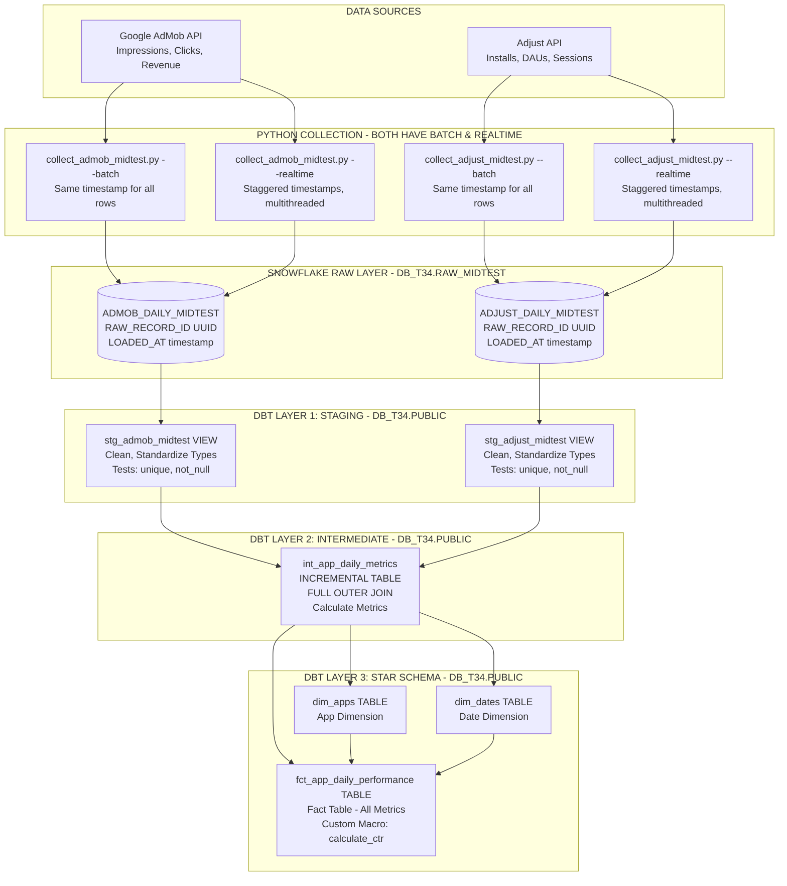
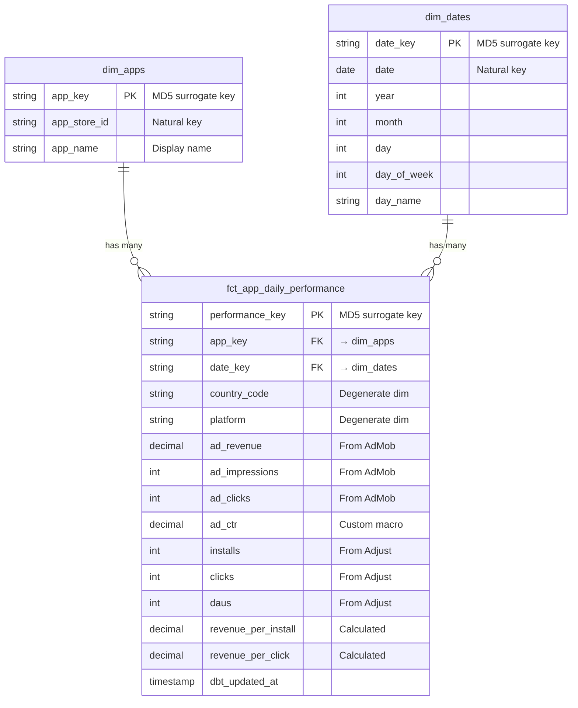

# Data Pipeline & Star Schema Architecture

## Complete Data Flow

---

## Star Schema ERD

---

## Table Schemas

### Fact Table: `fct_app_daily_performance`

**Grain**: One row per app per day per country per platform

| Column | Type | Source | Description |
|--------|------|--------|-------------|
| performance_key | STRING | Generated | PK - Surrogate key (MD5) |
| app_key | STRING | dim_apps | FK to apps dimension |
| date_key | STRING | dim_dates | FK to dates dimension |
| country_code | STRING | Both | Degenerate dimension |
| platform | STRING | Both | iOS/Android |
| ad_revenue | DECIMAL(18,2) | AdMob | Revenue from ads |
| ad_impressions | INTEGER | AdMob | Ad views |
| ad_clicks | INTEGER | AdMob | Ad clicks |
| ad_ctr | DECIMAL(18,2) | Calculated | CTR via calculate_ctr() macro |
| installs | INTEGER | Adjust | App installs |
| clicks | INTEGER | Adjust | User clicks |
| daus | INTEGER | Adjust | Daily active users |
| revenue_per_install | DECIMAL(18,2) | Calculated | ad_revenue / installs |
| revenue_per_click | DECIMAL(18,2) | Calculated | ad_revenue / clicks |
| dbt_updated_at | TIMESTAMP | System | Last transformation time |

### Dimension: `dim_apps`

| Column | Type | Description |
|--------|------|-------------|
| app_key | STRING | PK - MD5(app_store_id) |
| app_store_id | STRING | video.ai.videogenerator |
| app_name | STRING | Text to Video FLIX |

### Dimension: `dim_dates`

| Column | Type | Description |
|--------|------|-------------|
| date_key | STRING | PK - MD5(date) |
| date | DATE | 2024-10-22 |
| year | INTEGER | 2024 |
| month | INTEGER | 10 |
| day | INTEGER | 22 |
| day_of_week | INTEGER | 2 (Tuesday) |
| day_name | STRING | Tuesday |

---

## Transformation Layers

| Layer | Models | Materialization | Purpose |
|-------|--------|-----------------|---------|
| **Staging** | stg_admob_midtest stg_adjust_midtest | VIEW | Clean, standardize types, preserve UUID |
| **Intermediate** | int_app_daily_metrics | INCREMENTAL TABLE | FULL OUTER JOIN, calculate metrics |
| **Mart** | dim_apps dim_dates fct_app_daily_performance | TABLE | Star schema for analytics |

---

## Key Features

- **Data Collection**: Both AdMob & Adjust have --batch and --realtime modes
- **Data Quality**: 27 tests (unique, not_null, relationships)
- **Data Lineage**: UUID tracking from raw → staging
- **Performance**: Incremental materialization
- **Custom Logic**: calculate_ctr() macro
- **Star Schema**: Optimized for Snowflake analytics
